# 科研竞赛管理系统开发说明书

## 课程设计报告

- **报告名称**：科研竞赛管理系统开发说明书
- **撰写人**：尹彩艺
- **专业班级**：软件工程2307班
- **撰写时间**：2026.5.31

## 学术诚信声明

本人郑重声明：所呈交的课程设计报告《科研竞赛管理系统》，是本人在指导教师指导下独立进行研究与开发工作所取得的成果。除文中已经注明引用的内容外，本课程设计报告不包含任何其他个人或集体已经发表或撰写过的研究成果。对本系统的开发提供过帮助的个人和集体，均已在报告中明确说明并致以谢意。本人完全意识到本声明的法律后果由本人承担。

课程设计报告作者签名：\_\_\_\_\_\_\_\_\_\_\_\_\_\_\_\_

日期：\_\_\_\_\_\_\_\_年\_\_\_\_\_\_\_\_月\_\_\_\_\_\_\_\_日

---

# 摘 要

随着高校科研成果数量的持续增长和类型的日益多元化，传统的纸质化、半手工科研管理模式已难以满足现代高校科研管理的实际需求。本课程设计项目针对怀化学院科研竞赛管理的实际业务场景，设计并实现了一套基于B/S架构的科研竞赛管理系统（Competition
Research Management System,
CRMS）。系统采用前后端分离架构，后端基于Spring Boot
3.x框架和MyBatis-Plus持久层技术，前端采用Vue 3 Composition API和Element
Plus组件库，数据库选用MySQL
8.0。系统涵盖了学科竞赛成果、大学生创新创业训练计划项目、软件著作权和学术论文四类科研成果的全生命周期管理，实现了\"学生提交→科研秘书初审→学院领导终审→归档\"的两级审核工作流。系统创新性地集成了Tesseract.js前端OCR引擎，支持通过上传证书图片自动识别竞赛名称、获奖作品名称、获奖等级等关键字段。此外，系统还提供了文件管理、实时通知推送、个人成果中心（含雷达图可视化和CSV报告导出）、系统管理后台等完整功能模块。经测试验证，系统功能完善、运行稳定、用户体验良好，能够有效提升高校科研竞赛管理的工作效率和管理规范化水平。

**关键词**：科研管理系统；学科竞赛；Spring Boot；Vue 3；OCR识别；审核工作流

---

## 目 录

- [摘 要](#摘--要)
- [第1章 绪论](#第1章-绪论)
  - [1.1 研究背景与意义](#11-研究背景与意义)
  - [1.2 难点分析](#12-难点分析)
  - [1.3 国内外研究现状](#13-国内外研究现状)
  - [1.4 主要研究内容与结构安排](#14-主要研究内容与结构安排)
- [第2章 理论基础与关键技术](#第2章-理论基础与关键技术)
  - [2.1 Spring Boot 3.x 框架](#21-spring-boot-3x-框架)
  - [2.2 Vue 3 渐进式前端框架](#22-vue-3-渐进式前端框架)
  - [2.3 MyBatis-Plus 持久层框架](#23-mybatis-plus-持久层框架)
  - [2.4 MySQL 关系型数据库](#24-mysql-关系型数据库)
  - [2.5 Tesseract.js 光学字符识别引擎](#25-tesseractjs-光学字符识别引擎)
  - [2.6 JWT与Spring Security安全框架](#26-jwt与spring-security安全框架)
- [第3章 系统分析](#第3章-系统分析)
  - [3.1 可行性分析](#31-可行性分析)
  - [3.2 功能需求](#32-功能需求)
  - [3.3 数据需求分析](#33-数据需求分析)
- [第4章 系统设计](#第4章-系统设计)
  - [4.1 系统架构](#41-系统架构)
  - [4.2 系统整体功能结构](#42-系统整体功能结构)
  - [4.3 系统行为设计](#43-系统行为设计)
  - [4.4 数据库设计](#44-数据库设计)
- [第5章 系统实现](#第5章-系统实现)
  - [5.1 用户认证模块实现](#51-用户认证模块实现)
  - [5.2 学科竞赛成果管理模块实现](#52-学科竞赛成果管理模块实现)
  - [5.3 两级审核工作流模块实现](#53-两级审核工作流模块实现)
  - [5.4 前端OCR智能识别模块实现](#54-前端ocr智能识别模块实现)
  - [5.5 论文匹配模块实现](#55-论文匹配模块实现)
  - [5.6 文件导出功能模块实现](#56-文件导出功能模块实现)
  - [5.7 系统主要功能页面展示](#57-系统主要功能页面展示)
- [第6章 系统测试](#第6章-系统测试)
  - [6.1 测试环境](#61-测试环境)
  - [6.2 用例说明](#62-用例说明)
  - [6.3 测试结果](#63-测试结果)
  - [6.4 测试结果分析与讨论](#64-测试结果分析与讨论)
- [第7章 总结与展望](#第7章-总结与展望)
- [参考文献](#参考文献)
- [附录 主要功能操作手册](#附录-主要功能操作手册)

---

随着我国高等教育事业的快速发展和\"双一流\"建设的深入推进，高等院校科研管理工作的信息化、数字化转型已成为不可逆转的趋势。怀化学院作为湖南省属全日制普通本科院校，每年在学科竞赛、大学生创新创业训练计划项目、软件著作权登记和学术论文发表等领域产出大量学生科研成果。然而，传统的科研管理模式普遍存在以下突出问题：一是成果信息采用Excel表格或纸质材料分散管理，数据检索、统计和分析效率低下；二是成果审核依赖线下签字流转，审核周期长、过程不透明，师生无法实时追踪审核进度；三是缺乏统一的成果展示与管理平台，师生难以便捷地查看个人成果概览和成果分布情况；四是数据孤岛现象严重，学院管理层难以从宏观层面掌握科研成果的整体发展趋势，不利于学科建设和资源配置决策。

针对上述痛点问题，本课程设计项目开发了一套面向高校科研竞赛管理的综合信息系统------科研竞赛管理系统（CRMS）。系统采用前后端分离的B/S架构设计，综合运用Spring
Boot 3.x、Vue
3、MyBatis-Plus、MySQL等企业级开发技术，集成了Tesseract.js光学字符识别（OCR）引擎，实现了从成果提交、多级审核、文件管理到数据统计分析的完整业务闭环。系统的开发与应用对于推进地方本科院校科研管理信息化建设、提升科研管理工作效率和管理规范化水平具有重要的现实意义和应用价值。

## 1.2 难点分析

本系统的设计与实现面临以下核心技术难点：

（1）多类型成果的统一管理：系统需要同时管理学科竞赛、大创项目、软件著作权和学术论文四类结构各异的科研成果，每类成果包含不同的字段属性。如何设计统一的数据访问接口和灵活的前端页面组件，使得各类型成果能够在统一的框架下进行CRUD操作，是系统设计的主要挑战之一。本系统采用MyBatis-Plus的通用Mapper和Lambda查询包装器模式，结合Spring的泛型Service设计，实现了各类型成果的数据访问层复用。

（2）多级审核工作流的状态管理：系统需要实现\"待审核（pending_review）→审核中（under_review）→已归档（archived）\"的审核状态流转，同时支持退回（returned）和撤回（withdrawn）两种异常路径。如何保证状态流转的正确性（防止重复审核、越权操作）是业务逻辑层的核心难点。本系统通过ReviewServiceImpl中严格的状态前置校验（requiredCurrentStatus检查）和数据库事务管理（@Transactional注解）来确保审核流程的原子性和一致性。

（3）前端OCR识别与字段智能提取：系统需要在前端浏览器环境中实现对上传证书图片的文字识别和关键字段自动提取。传统的OCR方案依赖服务端处理，存在图片上传延迟和隐私风险。本系统创新性地采用Tesseract.js在浏览器端进行OCR识别，通过正则表达式对识别文本进行结构化字段解析，实现了端到端的纯前端OCR解决方案。

## 1.3 国内外研究现状

国外高校科研管理系统（Research Information Management System,
RIMS）的发展起步较早，已形成较为成熟的技术体系和应用生态。以Elsevier
Pure、Symplectic
Elements等为代表的商业科研管理平台，集成了科研成果采集、学者画像构建和研究影响力分析等功能，支持与ORCID、Scopus等国际学术平台的深度数据对接。在技术架构层面，国外系统普遍采用微服务架构、云计算部署和RESTful
API设计范式，具备良好的可扩展性和互操作性。然而，这些商业系统授权费用高昂，且不完全适应中国高校科研管理的特殊需求，如学科竞赛的等级分类体系、中文审核流程的特殊性以及国内政策合规要求等。

国内高校科研管理系统的建设经历了从单机版管理软件到网络化综合平台的演进历程。近年来，刘建国等针对高校科研管理中的信息孤岛问题[^\[6\]^](#_Ref26138)，设计了一套基于B/S架构的科研信息管理平台，实现了项目申报、经费管理和成果统计等功能的初步集成。赵明等探讨了微服务架构在科研管理系统中的应用[^\[8\]^](#_Ref26416)，通过服务拆分策略提升了系统的可维护性和可扩展性。在实际应用层面，清华大学、北京大学等顶尖高校已建成较为完善的科研管理信息系统，但地方本科院校由于资金和技术条件限制，信息化建设水平参差不齐。目前市场上尚缺乏专门针对学科竞赛成果管理、集成前端OCR智能识别功能且完全开源可定制的高校科研竞赛管理系统，这正是本项目研究的重要切入点和创新所在。

## 1.4 主要研究内容与结构安排

本项目的主要研究内容包括以下六个方面：（1）对高校科研竞赛管理的业务流程进行深入分析，明确系统的功能需求和非功能需求；（2）设计系统的总体架构方案，确定前后端分离的技术选型和功能模块划分策略；（3）完成数据库的概念结构设计和逻辑结构设计，建立规范化关系型数据模型；（4）实现各功能模块的编码开发，涵盖用户认证授权、四类成果CRUD、两级审核工作流、文件上传下载、OCR智能识别、通知推送及数据统计可视化等核心功能；（5）进行全面的系统测试，包括功能测试、兼容性测试、安全性测试和性能测试；（6）撰写系统开发文档和用户使用手册。

本报告的结构安排如下：

- **第1章 绪论**：介绍项目研究背景、难点、研究现状及主要研究内容
- **第2章 理论基础与关键技术**：阐述系统所采用的核心开发框架和技术原理
- **第3章 系统分析**：进行可行性分析、功能需求分析和数据需求分析
- **第4章 系统设计**：展示系统架构、功能结构、行为设计和数据库设计
- **第5章 系统实现**：说明核心功能模块的详细实现过程（含关键代码）并展示运行截图
- **第6章 系统测试**：报告测试方案、测试用例和测试结果
- **第7章 总结与展望**：回顾项目完成情况并展望未来优化方向

---

# 第2章 理论基础与关键技术

## 2.1 Spring Boot 3.x 框架

Spring
Boot是由Pivotal团队（现属Broadcom公司）开发的企业级Java应用快速开发框架，其设计哲学是\"约定优于配置\"（Convention
over Configuration）[^\[15\]^](#_Ref26896)。Spring Boot
3.x是当前最新的主版本，基于Jakarta EE 10规范和Java
17基线，提供了自动配置（Auto-Configuration）、嵌入式Web服务器（Embedded
Tomcat/Jetty）、Actuator生产级监控端点、外部化配置等核心能力。本系统采用Spring
Boot 3.x作为后端核心框架，利用其Starter机制快速集成了Spring
MVC（Web接口）、Spring
Security（安全认证）、MyBatis-Plus（数据持久化）和Spring
Transaction（事务管理）等关键组件，显著降低了系统搭建的复杂性，使开发者能够将精力集中于业务逻辑的实现。

## 2.2 Vue 3 渐进式前端框架

Vue 3是由尤雨溪（Evan
You）领导的团队开发的渐进式JavaScript前端框架，于2020年9月正式发布[^\[16\]^](#_Ref27004)。Vue
3引入了基于Proxy的响应式系统（Reactivity System）、Composition
API（组合式API）、Teleport组件、Fragments虚拟节点等重大架构改进。本系统前端全面采用Vue
3 Composition API开发模式，通过\<script
setup\>语法糖简化组件代码的编写，利用ref和reactive实现数据的响应式绑定，使用computed进行派生状态计算，通过watch监听数据变化，使用onMounted等生命周期钩子管理组件状态。构建工具选用Vite
5，相较于传统Webpack具有极速冷启动（ESBuild预构建）和即时热模块替换（HMR）的显著优势。UI组件库选用Element
Plus，提供了表格（el-table）、表单（el-form）、对话框（el-dialog）、标签页（el-tabs）等80余个高质量企业级组件。

## 2.3 MyBatis-Plus 持久层框架

MyBatis-Plus是苞米豆团队在Apache
MyBatis基础上开发的增强工具包，在\"只做增强不做改变\"的理念下，提供了通用Mapper（BaseMapper）、Lambda查询包装器（LambdaQueryWrapper）、分页插件（PaginationInnerInterceptor）、自动填充（MetaObjectHandler）、逻辑删除等开箱即用的增强功能[^\[4\]^](#_Ref27307)。本系统通过继承BaseMapper\<T\>接口获得基本的CRUD能力，使用LambdaQueryWrapper构建类型安全的动态查询条件，利用分页插件实现服务端分页查询，并通过@TableField注解的fill属性配合MetaObjectHandler实现createTime和updateTime的自动填充。MyBatis-Plus的参数化查询机制也从根本上防止了SQL注入攻击。

## 2.4 MySQL 关系型数据库

MySQL
8.0是Oracle公司开发和维护的开源关系型数据库管理系统，是目前Web应用领域使用最广泛的关系型数据库之一。MySQL
8.0引入了窗口函数（Window
Functions）、公共表表达式（CTE）、JSON增强、InnoDB
Cluster等高阶特性。本系统选用MySQL
8.0作为数据存储引擎，采用utf8mb4字符集（完整支持中文字符和Emoji表情），通过B+树索引优化高频查询字段（如submit_user_id、status、achievement_type等）的检索性能，利用InnoDB存储引擎的事务支持（ACID）确保审核流程等关键操作的数据一致性。

## 2.5 Tesseract.js 光学字符识别引擎

Tesseract是Google维护的开源OCR（Optical Character
Recognition，光学字符识别）引擎，最初由HP实验室于1985年开发，2006年起由Google主导维护[^\[11\]^](#_Ref28088)。Tesseract
4.x版本引入了基于LSTM（长短期记忆网络）的深度学习识别模型^[\[12\]](#_Ref28316)[\[13\]](#_Ref28326)^，支持超过100种语言的文字识别。Tesseract.js是Tesseract引擎的WebAssembly/Emscripten编译版本，使得OCR识别可以直接在浏览器环境中运行，无需服务端参与。本系统通过动态导入（Dynamic
Import）方式在前端加载Tesseract.js，使用chi_sim+eng（中文简体+英文）语言包对上传的证书图片进行中英文混合识别。识别完成后，系统通过JavaScript正则表达式对OCR原始文本进行结构化解析，自动提取竞赛名称、获奖作品名称、获奖等级、获奖级别和获奖时间等关键字段。该方案的核心优势在于：所有计算在客户端完成，保护用户隐私数据不离开浏览器；无服务端OCR处理压力，系统可扩展性更强。

## 2.6 JWT与Spring Security安全框架

JSON Web Token（JWT）是一种基于JSON的开放标准（RFC 7519），用于在通信双方之间传递经过数字签名的安全声明。JWT由头部（Header）、负载（Payload）和签名（Signature）三部分组成，通过点号（.）连接。Spring Security是Spring生态系统的安全框架，提供了从认证（Authentication）到授权（Authorization）的完整安全解决方案[^15]。

本系统将JWT与Spring Security深度整合：用户登录成功后，服务端使用HMAC-SHA256算法生成包含用户ID（sub）、用户名（username）和角色（role）信息的JWT Token并返回前端；前端将Token存储在localStorage中，并在所有后续API请求的Authorization Header中携带（Bearer schema）[^10]；后端通过自定义JwtAuthenticationFilter（继承OncePerRequestFilter）拦截每个HTTP请求，从Header中提取并验证Token，解析用户身份信息后构建认证对象注入SecurityContextHolder。权限控制采用基于角色的访问控制（RBAC）模型[^9]，结合前端路由的meta.roles元信息和后端Service层的角色校验，实现前后端双重鉴权防护。

---

# 第3章 系统分析

## 3.1 可行性分析

### 3.1.1 技术可行性

本系统采用的技术栈均为当前业界成熟、广泛应用且社区活跃的开源技术。后端Spring Boot 3.x是Java生态系统中最主流的企业级开发框架，拥有海量的文档、教程和社区支持资源[^7][^15]。前端Vue 3自2020年发布以来已历经多个大版本的迭代优化，生态成熟度极高[^16]。MyBatis-Plus在国内Java开发领域拥有极高的市场占有率[^4]。MySQL 8.0是全球使用率最高的开源关系型数据库[^1]。OCR功能方面，Tesseract.js在npm平台周下载量超过10万次，已有大量实际生产环境使用案例[^11]。上述技术均为开源产品，不存在技术锁定或知识产权风险。综合评估，项目在技术层面具有充分的可行性。

### 3.1.2 经济可行性

本系统的开发与部署完全基于开源技术栈，无需采购任何商业软件许可证。JDK 17（Amazon Corretto/OpenJDK）、Node.js、MySQL Community Server均可免费商用。开发工具IntelliJ IDEA社区版和Visual Studio Code均为免费工具。对于怀化学院而言，将系统部署于一台校内Linux服务器的成本远低于采购商业科研管理平台的年度订阅费用。从长期运营来看，系统的上线将显著减少科研管理的人工成本（减少纸质材料流转、手工统计和重复录入的时间消耗），具有明确的经济效益[^6][^8]。

### 3.1.3 操作可行性

系统采用B/S（Browser/Server）架构，用户仅需通过主流浏览器即可访问，无需安装任何客户端软件[^10]。前端界面设计遵循Element Plus设计规范，布局清晰、操作引导完善。系统针对四类用户角色（学生/教师、科研秘书、学院领导、系统管理员）分别呈现差异化的功能界面：学生主要进行成果提交和个人成果管理，秘书和领导专注于审核待办任务，管理员负责系统配置维护。各角色功能边界明确，操作流程符合高校人员的日常工作习惯，学习成本低，无需专门培训即可上手[^2][^6]。

### 3.1.4 法律与安全可行性

系统在安全设计方面采取了多层防护措施：密码采用BCrypt（强度因子10）加盐哈希存储；身份认证基于JWT无状态Token机制；权限控制采用RBAC模型并在前后端双重校验；数据库操作全部使用参数化查询防止SQL注入；文件上传校验类型白名单和大小限制防止恶意文件上传；生产环境可配置HTTPS全站加密。系统不涉及收集用户个人敏感信息（身份证号、银行卡号等）或进行商业盈利活动，所有技术实现均在《网络安全法》《数据安全法》《个人信息保护法》的法律框架内进行，法律合规性良好。

---

## 3.2 功能需求

根据对怀化学院科研竞赛管理实际业务流程的深入调研与分析，本系统需具备以下十二个核心功能模块：

1. **用户认证与权限管理**：支持用户名密码登录、JWT Token认证与续期、四角色（系统管理员/学生教师/科研秘书/学院领导）RBAC权限控制。

2. **学科竞赛成果管理**：支持竞赛成果的在线提交（涵盖竞赛类别、竞赛名称、获奖作品名称、主办单位、获奖等级/级别、获奖时间、指导教师、参与学生等字段）、编辑、删除、撤回及多条件组合检索。支持关键字搜索同时匹配竞赛名称和获奖作品名称两个字段。

3. **大创项目管理**：支持大学生创新创业训练计划项目的提交与管理，涵盖项目名称、立项级别（国家级/省级/校级/院级）、项目类型（创新训练/创业训练/创业实践）、指导教师、项目成员、立项时间等字段[^17]。

4. **软件著作权管理**：支持软件著作权登记信息的录入与管理，登记号支持正则格式校验（格式如2025SR11569875）。

5. **学术论文管理**：支持学术论文的在线提交，涵盖论文标题、投稿/录用日期、期刊/会议名称、期刊级别（CCF A/B/C类、SCI一~四区、北大核心等）、关键词、作者信息等字段，内置CCF推荐期刊/会议目录查询功能。

6. **两级审核工作流**：实现"学生提交→科研秘书初审→学院领导终审→归档"的标准审核流程，支持审核通过、审核退回（含审核意见）、退回后修改重提等完整操作。审核过程全程记录到review_record和achievement_timeline两张表中。

7. **文件管理**：支持多文件上传、下载、在线预览和删除，文件与成果记录关联存储，支持PDF、Word、Excel、图片等格式，单个文件不超过20MB。

8. **OCR智能识别**：基于Tesseract.js在浏览器端实现证书图片（JPG/PNG/BMP）的中英文混合识别与关键字段自动提取，识别结果经用户确认后可一键应用到提交表单。

9. **实时通知推送**：审核状态变更时自动向相关用户（提交者、下一级审核人）推送系统通知消息。

10. **个人成果中心**：提供成果概览仪表板（含雷达图可视化）、成果列表筛选与搜索、置顶管理（is_pinned字段）和CSV格式成果报告导出功能。

11. **数据统计仪表盘**：系统首页展示KPI统计卡片（各类成果总量、审核各状态数量等）、成果分类分布图和月度趋势图，采用vue-echarts进行图表渲染。

12. **系统管理后台（管理员专有）**：用户管理（增删改查、角色分配、启用/禁用）、系统公告发布与管理和操作日志查看。

---

（12）系统管理后台（管理员专有）：用户管理（增删改查、角色分配、启用/禁用）、系统公告发布与管理和操作日志查看。

## 3.3 数据需求分析

系统的核心业务数据涵盖以下数据实体及关系：

- **用户数据（sys_user）**：包括用户名、BCrypt加密密码、真实姓名、联系方式（电话、邮箱）、所属角色（role_id外键关联sys_role表）和账户状态（status字段：0=禁用，1=启用）。用户数据是整个系统的身份基础。

- **学科竞赛成果数据（competition_achievement）**：包括竞赛基本信息（类别、名称、主办/承办/颁奖单位）、获奖信息（获奖等级、级别、时间、获奖作品名称work_name）和参与人员信息（指导教师、参赛学生）。其中work_name字段用于记录具体获奖作品的名称，与competition_name（竞赛名称）形成互补。

- **大创项目数据（innovation_project）**：包括项目名称、立项级别和类型、指导教师、项目成员、立项时间和审核状态[^17]。

- **软件著作权数据（software_copyright）**：包括软件名称、所属单位、著作权人、登记号（正则校验格式\d{4}SR\d{7,8}）和登记日期。

- **学术论文数据（academic_paper）**：包括论文标题、投稿/录用日期、期刊/会议名称、期刊级别（含CCF分类和SCI分区）、关键词和作者信息。

- **审核记录数据（review_record）**：关联成果类型（achievement_type）和成果ID（achievement_id），记录审核人（reviewer_id）、审核级别（review_level: secretary/leader）、审核结果（status: approved/rejected）、审核意见（comment）和审核时间（review_time）。

- **文件数据（sys_file）**：包括文件原始名称（original_name）、UUID存储名称（stored_name）、存储路径（file_path）、文件大小（file_size）、MIME类型（file_type）和关联的成果信息（achievement_type + achievement_id）。

- **通知数据（notification）**：包括通知标题（title）、内容（content）、接收用户ID（user_id）、关联成果信息（related_type + related_id）、通知类型（notification_type: system/review/reminder）和已读状态（is_read: 0/1）。

- **时间线数据（achievement_timeline）**：记录成果从提交到归档全过程中每一次状态变更的节点（node）、操作人（operator_id + operator_name）、操作类型（action: submit/approve/reject/edit）和备注（comment）。

---

# 第4章 系统设计

## 4.1 系统架构

本系统采用当前Web应用开发领域主流的"前后端分离"（Frontend-Backend Separation）架构模式，整体设计遵循三层架构（Three-Tier Architecture）的分层思想。前端为基于Vue 3构建的单页面应用（SPA），通过Vite进行模块化构建打包，生成的静态资源部署于Nginx Web服务器。后端为基于Spring Boot 3.x构建的RESTful API服务，以JSON格式与前端进行数据交换。前后端通过HTTP/HTTPS协议完全解耦通信，可独立开发、独立构建、独立部署和独立扩展。

系统分层架构的具体组织如下：

- **表现层（Presentation Layer）**：由Vue 3前端应用承担，负责用户界面的渲染展示和用户交互逻辑的处理，通过Axios HTTP客户端向后端API发起异步请求。

- **业务逻辑层（Business Logic Layer）**：由Spring Boot后端的Service层承担，负责核心业务规则的处理（如审核状态流转校验、通知自动推送、重复性检测等）和数据库事务管理，是系统业务价值的核心承载层。

- **数据访问层（Data Access Layer）**：由MyBatis-Plus承担，负责与MySQL数据库的SQL映射、对象关系映射（ORM）和连接池管理。

三层各司其职，通过清晰的接口契约进行层间通信，有效降低了系统耦合度。系统总体架构图如图4.1所示。

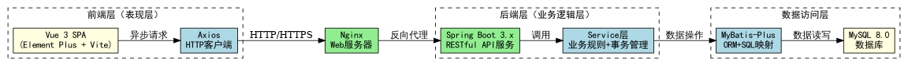{width="6.148611111111111in" height="0.4534722222222222in"}

**图4.1 系统总体架构图**

## 4.2 系统整体功能结构

根据需求分析结果，系统功能按模块化原则划分为十二个核心模块。各模块之间通过API接口和事件机制进行松耦合协作。系统整体功能结构如图4.2所示。系统功能模块划分表如表4-1所示。

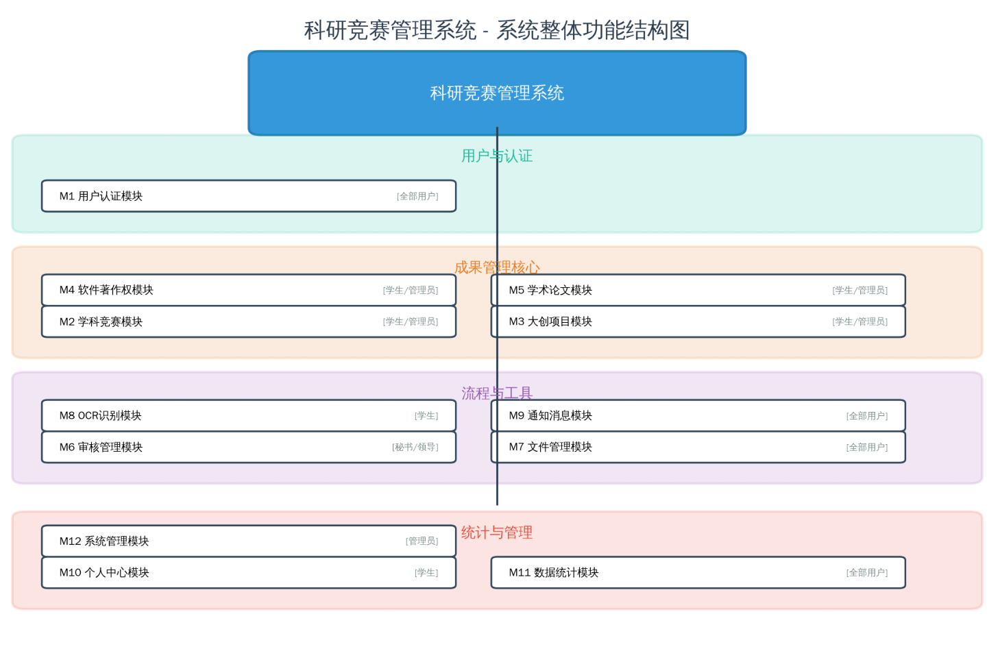{width="4.945833333333334in" height="2.953472222222222in"}

**图4.2 系统整体功能结构图**

### 表4-1 系统功能模块划分表

  --------------- ---------------- ------------------------------------------ ------------------
     **序号**       **模块名称**                  **核心功能**                 **主要用户角色**

        M1          用户认证模块        登录、注销、Token刷新、密码修改            全部用户

        M2          学科竞赛模块    竞赛成果CRUD、多条件检索、撤回、OCR识别     STUDENT/ADMIN

        M3          大创项目模块         创新项目CRUD、多条件检索、撤回         STUDENT/ADMIN

        M4         软件著作权模块      软著信息CRUD、登记号格式校验、检索       STUDENT/ADMIN

        M5          学术论文模块        论文信息CRUD、CCF目录查询、检索         STUDENT/ADMIN

        M6          审核管理模块    两级审核（秘书初审→领导终审）、通过/退回   SECRETARY/LEADER

        M7          文件管理模块     文件上传/下载/删除、格式校验、关联存储        全部用户

        M8          OCR识别模块       证书图片文字识别、字段智能提取与回填         STUDENT

        M9          通知消息模块      审核通知自动推送、已读/未读状态管理          全部用户

        M10         个人中心模块      成果概览、雷达图、置顶管理、CSV导出          STUDENT

        M11         数据统计模块         KPI卡片、分类/趋势图表、仪表盘            全部用户

        M12         系统管理模块          用户管理、公告管理、操作日志              ADMIN
  --------------- ---------------- ------------------------------------------ ------------------

## 4.3 系统行为设计

本小节通过UML时序图描述系统的核心行为------科研成果提交与审核的完整交互流程。

**成果提交流程**：学生用户在竞赛成果提交页面（CompetitionForm.vue）填写表单信息，可选择性使用OCR功能识别证书图片自动填充字段。前端在表单提交前先进行客户端校验（ElForm.validate()），校验通过后调用/api/check/duplicate接口进行重复检测，若发现疑似重复记录则弹出确认对话框。用户确认后，前端将数据POST至/api/competition接口。后端CompetitionController接收请求，CompetitionServiceImpl.create()方法在@Transactional事务保护下创建实体记录，设置状态为pending_review（待审核），关联上传文件（updateFileAssociations），记录时间线事件（timelineService.addEvent），并向所有科研秘书推送通知（notifySecretaries）。

**审核审批流程**：科研秘书登录后访问审核管理页面，系统从/api/review/todo接口获取待审核列表（status=pending_review）。秘书查看成果详情后进行审核操作：若选择"通过"，系统将成果状态更新为under_review（审核中），记录审核通过的时间线事件，通知提交者成果已通过初审，同时通知学院领导进行终审（notifyRoleUsers("LEADER",...)）；若选择"退回"，系统将成果状态更新为returned（已退回），记录退回原因，通知提交者进行修改。学院领导的终审流程与初审类似，审核通过后成果进入archived（已归档）状态。成果提交与审核时序图如图4.3所示。

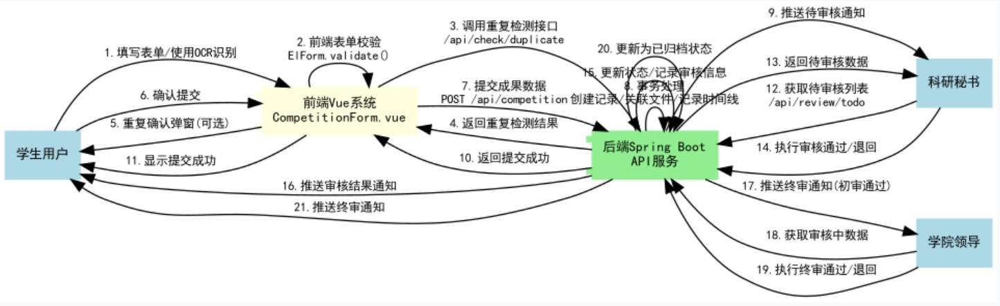{width="5.127777777777778in" height="1.5729166666666667in"}

**图4.3 成果提交与审核时序图**

## 4.4 数据库设计

系统数据库命名为cms_db，采用utf8mb4字符集（utf8mb4_unicode_ci排序规则），以完整支持中文字符、特殊符号和Emoji表情的存储。以下为数据库的概念结构设计和逻辑结构设计。

### 4.4.1 概念结构设计（E-R图）

系统数据库的概念结构围绕"用户---成果---审核"三大核心实体及其关系展开。用户实体（sys_user）与四类成果实体（competition_achievement、innovation_project、software_copyright、academic_paper）之间为一对多（1:N）关系，即一个用户可以提交多条不同类型的成果记录。每类成果实体与审核记录实体（review_record）之间为一对多关系，一条成果在审核流程中会产生多条审核记录（秘书初审和领导终审）。成果实体与文件实体（sys_file）之间为一对多关系，一条成果可关联多个证明文件。成果实体与时间线实体（achievement_timeline）之间为一对多关系，记录成果状态的每一次变更。用户实体与通知实体（notification）之间为一对多关系。E-R图如图4.4所示。

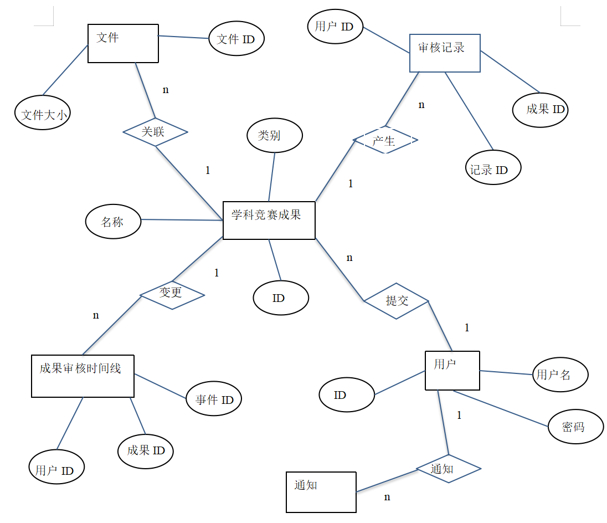{width="4.871527777777778in" height="4.196527777777778in"}

**图4.4 系统数据库E-R图**

### 4.4.2 核心数据表结构

以下列出系统核心数据表的详细结构设计。每张表均遵循第三范式（3NF）进行规范化设计。各成果表采用统一的状态字段命名规范（status字段共享相同取值空间），便于跨表进行联合查询和聚合统计。

**表4-2 sys_user 用户表结构**

  ----------------- ----------------- ----------------- ------------------------------
     **字段名**       **数据类型**        **约束**                 **说明**

         id              BIGINT              PK,             用户ID（主键，自增）
                                       AUTO_INCREMENT   

      username         VARCHAR(50)    NOT NULL, UNIQUE        用户名（登录账号）

      password        VARCHAR(255)        NOT NULL          密码（BCrypt加密存储）

      real_name        VARCHAR(50)      DEFAULT NULL               真实姓名

        phone          VARCHAR(20)      DEFAULT NULL               手机号码

        email         VARCHAR(100)      DEFAULT NULL               电子邮箱

       role_id           BIGINT         NOT NULL, FK     角色ID（外键，关联sys_role）

       status            TINYINT      NOT NULL, DEFAULT   账户状态（0=禁用，1=启用）
                                              1         

     create_time        DATETIME          NOT NULL                 创建时间

     update_time        DATETIME          NOT NULL                 更新时间
  ----------------- ----------------- ----------------- ------------------------------

（2）学科竞赛成果表如表4-3所示。

表4-3 competition_achievement 学科竞赛成果表结构

  ---------------------- -------------- ---------------- ----------------------------------------------------------
        **字段名**        **数据类型**      **约束**                              **说明**

            id               BIGINT           PK,                           成果ID（主键，自增）
                                         AUTO_INCREMENT  

   competition_category   VARCHAR(10)       NOT NULL                        竞赛类别（A/B/C类）

     competition_name     VARCHAR(200)      NOT NULL                              竞赛名称

        host_unit         VARCHAR(200)    DEFAULT NULL                            主办单位

      organizer_unit      VARCHAR(200)    DEFAULT NULL                            承办单位

        award_unit        VARCHAR(200)    DEFAULT NULL                            颁奖单位

       award_level        VARCHAR(50)       NOT NULL      获奖等级（national/provincial/municipal/school/college）

       award_grade        VARCHAR(20)       NOT NULL                   获奖级别（first/second/third）

        award_time            DATE        DEFAULT NULL                            获奖日期

        work_name         VARCHAR(200)    DEFAULT NULL                  获奖作品名称（核心新增字段）

         advisor          VARCHAR(50)     DEFAULT NULL                          指导教师姓名

       participants           TEXT        DEFAULT NULL                      参赛学生（逗号分隔）

          status          VARCHAR(20)      NOT NULL,                              审核状态
                                            DEFAULT      
                                         pending_review  

      submit_user_id         BIGINT         NOT NULL                             提交用户ID

        is_pinned           TINYINT        DEFAULT 0                       是否置顶（0=否，1=是）

       create_time          DATETIME        NOT NULL                              创建时间

       update_time          DATETIME        NOT NULL                              更新时间
  ---------------------- -------------- ---------------- ----------------------------------------------------------

（3）审核记录表如表4-4所示。

表4-4 review_record 审核记录表结构

  ------------------ -------------- ---------------- ----------------------------------------------------
      **字段名**      **数据类型**      **约束**                           **说明**

          id             BIGINT           PK,                        记录ID（主键，自增）
                                     AUTO_INCREMENT  

   achievement_type   VARCHAR(20)       NOT NULL      成果类型（competition/innovation/copyright/paper）

    achievement_id       BIGINT         NOT NULL                            成果ID

     reviewer_id         BIGINT         NOT NULL                         审核人用户ID

     review_level     VARCHAR(20)       NOT NULL                 审核级别（secretary/leader）

        status        VARCHAR(20)       NOT NULL                审核结果（approved/rejected）

       comment            TEXT        DEFAULT NULL                      审核意见/备注

     review_time        DATETIME        NOT NULL                           审核时间
  ------------------ -------------- ---------------- ----------------------------------------------------

（4）成果审核时间线表如表4-5所示。

表4-5 achievement_timeline 成果审核时间线表结构

  ------------------ -------------- ---------------- ------------------------------------------------------------------------
      **字段名**      **数据类型**      **约束**                                     **说明**

          id             BIGINT           PK,                                  事件ID（主键，自增）
                                     AUTO_INCREMENT  

   achievement_type   VARCHAR(20)       NOT NULL                                     成果类型

    achievement_id       BIGINT         NOT NULL                                      成果ID

         node         VARCHAR(50)       NOT NULL      事件节点（submitted/secretary_review/leader_review/archived/returned）

     operator_id         BIGINT         NOT NULL                                   操作人用户ID

    operator_name     VARCHAR(50)     DEFAULT NULL                                  操作人姓名

        action        VARCHAR(20)       NOT NULL                      操作类型（submit/approve/reject/edit）

       comment            TEXT        DEFAULT NULL                                   备注说明

     create_time        DATETIME        NOT NULL                                     事件时间
  ------------------ -------------- ---------------- ------------------------------------------------------------------------

（5）文件表如表4-6所示。

表4-6 sys_file 文件表结构

  ------------------ ----------------- ----------------- --------------------------
      **字段名**       **数据类型**        **约束**               **说明**

          id              BIGINT              PK,           文件ID（主键，自增）
                                        AUTO_INCREMENT   

    original_name      VARCHAR(255)        NOT NULL             文件原始名称

     stored_name       VARCHAR(255)        NOT NULL       存储文件名（UUID重命名）

      file_path        VARCHAR(500)        NOT NULL             文件存储路径

      file_size           BIGINT           NOT NULL           文件大小（字节）

       file_ext         VARCHAR(20)      DEFAULT NULL            文件扩展名

      file_type         VARCHAR(50)      DEFAULT NULL             MIME类型

   achievement_type     VARCHAR(20)      DEFAULT NULL           关联成果类型

    achievement_id        BIGINT         DEFAULT NULL            关联成果ID

    upload_user_id        BIGINT           NOT NULL              上传用户ID

     create_time         DATETIME          NOT NULL               上传时间
  ------------------ ----------------- ----------------- --------------------------

### 4.4.3 表关系说明

系统数据库各表之间的逻辑关系如下：

（1）用户-角色关系：sys_user表通过role_id外键字段与sys_role表建立N:1关联，系统预置四种角色：ADMIN（系统管理员）、STUDENT（学生/教师）、SECRETARY（科研秘书）、LEADER（学院领导）。

（2）用户-成果关系：四类成果表均通过submit_user_id字段与sys_user表的id字段关联（N:1），每个用户可以提交多条成果记录。

（3）成果-审核关系：review_record表通过achievement_type和achievement_id组合字段关联到各成果表的对应记录，通过reviewer_id关联到sys_user表。一条成果可有多条审核记录。

（4）成果-时间线关系：achievement_timeline表采用与review_record表相同的关联模式，独立记录成果全生命周期的每一次状态变更事件。

（5）成果-文件关系：sys_file表通过achievement_type和achievement_id字段关联到各成果表的具体记录（N:1），一条成果可关联多个证明文件。

（6）用户-通知关系：notification表通过user_id关联到通知接收用户（N:1），同时通过related_type和related_id关联到触发通知的成果记录。

说明：由于系统采用MyBatis-Plus作为ORM框架且四类成果表结构存在差异，数据库层面未设置物理外键约束（FOREIGN
KEY），而是通过在应用层Service代码中维护数据引用的完整性和一致性。审核状态值在各成果表之间保持统一（pending_review、under_review、returned、archived、withdrawn），确保跨表查询的语义一致性。

# 第5章 系统实现

## 5.1 用户认证模块实现

用户认证模块是系统安全体系的核心入口，采用Spring Security 6 + JWT的无状态认证方案[^3][^15]。主要包含三个核心组件：JwtTokenProvider（Token生成与验证工具类）、JwtAuthenticationFilter（认证拦截过滤器，继承OncePerRequestFilter）和SecurityConfig（Spring Security配置类）。

登录流程为：用户在前端登录页面输入用户名和密码，通过POST /api/auth/login接口提交凭证。后端调用AuthenticationManager.authenticate()进行认证，UserDetailsServiceImpl从数据库加载用户信息，DaoAuthenticationProvider进行BCrypt密码比对。认证成功后，JwtTokenProvider.generateToken()生成包含userId、username和role三个自定义声明的JWT Token（有效期24小时），并返回给前端。

---

# 第5章 系统实现

以下为用户认证模块的核心代码实现。代码清单5-1展示了JwtTokenProvider类的完整实现，包括Token生成、解析和验证方法。

用户认证模块实现如图5.1所示。

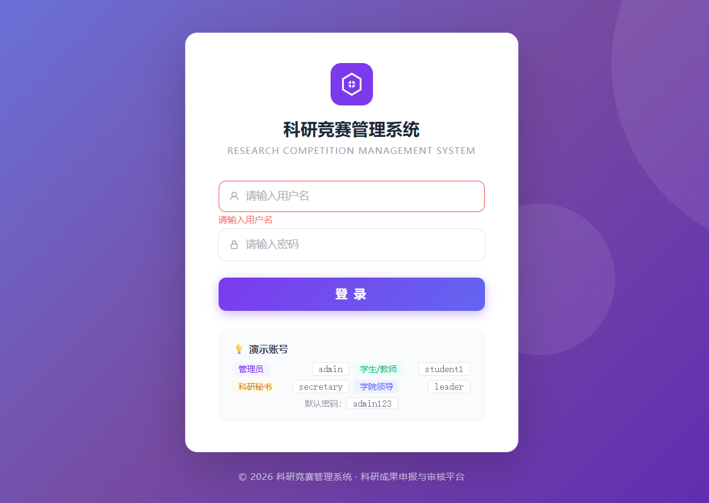{width="4.39375in" height="3.1145833333333335in"}

**图5.1 用户认证模块实现**

### 代码清单5-1 JwtTokenProvider.java --- JWT Token生成与验证核心类

```java
@Slf4j
@Component
public class JwtTokenProvider {

    private final SecretKey key;
    private final long expiration;

    public JwtTokenProvider(@Value("${jwt.secret}") String secret,
            @Value("${jwt.expiration}") long expiration) {
        this.key = Keys.hmacShaKeyFor(Base64.getDecoder().decode(secret));
        this.expiration = expiration;
    }

    public String generateToken(Long userId, String username, String role) {
        Date now = new Date();
        Date expiryDate = new Date(now.getTime() + expiration);
        return Jwts.builder()
                .subject(userId.toString())
                .claim("username", username)
                .claim("role", role)
                .issuedAt(now)
                .expiration(expiryDate)
                .signWith(key)
                .compact();
    }

    public boolean validateToken(String token) {
        try {
            Jwts.parser().verifyWith(key).build().parseSignedClaims(token);
            return true;
        } catch (JwtException | IllegalArgumentException e) {
            log.warn("Invalid JWT token: {}", e.getMessage());
            return false;
        }
    }

    public Long getUserId(String token) { /* parse subject */ }
    public String getUsername(String token) { /* parse claim */ }
    public String getRole(String token) { /* parse claim */ }
}
```

代码清单5-2展示了JwtAuthenticationFilter的实现。该过滤器继承OncePerRequestFilter，在每个HTTP请求到达时从Authorization
Header中提取Bearer Token，验证其有效性后解析用户身份并注入Spring
Security的SecurityContextHolder，完成无状态认证状态的设置。

代码清单5-2 JwtAuthenticationFilter.java --- JWT认证拦截过滤器

> \@Component
>
> \@RequiredArgsConstructor
>
> public class JwtAuthenticationFilter extends OncePerRequestFilter {
>
> private final JwtTokenProvider jwtTokenProvider;
>
> \@Override
>
> protected void doFilterInternal(HttpServletRequest request,
>
> HttpServletResponse response, FilterChain filterChain)
>
> throws ServletException, IOException {
>
> String token = getTokenFromRequest(request);
>
> if (StringUtils.hasText(token) &&
> jwtTokenProvider.validateToken(token)) {
>
> Long userId = jwtTokenProvider.getUserId(token);
>
> String username = jwtTokenProvider.getUsername(token);
>
> String role = jwtTokenProvider.getRole(token);
>
> UserPrincipal principal = new UserPrincipal(userId, username);
>
> UsernamePasswordAuthenticationToken authentication =
>
> new UsernamePasswordAuthenticationToken(principal, null,
>
> Collections.singletonList(
>
> new SimpleGrantedAuthority(\"ROLE\_\" + role)));
>
> SecurityContextHolder.getContext().setAuthentication(authentication);
>
> }
>
> filterChain.doFilter(request, response);
>
> }
>
> private String getTokenFromRequest(HttpServletRequest request) {
>
> String bearerToken = request.getHeader(\"Authorization\");
>
> if (StringUtils.hasText(bearerToken) &&
> bearerToken.startsWith(\"Bearer \")) {
>
> return bearerToken.substring(7);
>
> }
>
> return null;
>
> }
>
> }

代码清单5-3展示了SecurityConfig配置类，定义了Spring
Security的过滤器链规则：禁用CSRF（前后端分离架构）、设置Session为无状态策略（STATELESS）、配置公开和受保护接口的访问规则、注册CORS跨域配置、注入BCryptPasswordEncoder密码编码器。

代码清单5-3 SecurityConfig.java --- Spring Security安全配置类

> \@Configuration
>
> \@EnableWebSecurity
>
> \@EnableMethodSecurity
>
> \@RequiredArgsConstructor
>
> public class SecurityConfig {
>
> private final JwtAuthenticationFilter jwtAuthenticationFilter;
>
> \@Bean
>
> public SecurityFilterChain filterChain(HttpSecurity http) throws
> Exception {
>
> http
>
> .cors(cors -\> cors.configurationSource(corsConfigurationSource()))
>
> .csrf(csrf -\> csrf.disable())
>
> .sessionManagement(session -\>
>
> session.sessionCreationPolicy(SessionCreationPolicy.STATELESS))
>
> .authorizeHttpRequests(auth -\> auth
>
> .requestMatchers(\"/api/auth/login\").permitAll()
>
> .requestMatchers(\"/api/admin/\*\*\").hasRole(\"ADMIN\")
>
> .requestMatchers(HttpMethod.POST, \"/api/review/\*\*\")
>
> .hasAnyRole(\"ADMIN\", \"SECRETARY\", \"LEADER\")
>
> .anyRequest().authenticated()
>
> )
>
> .addFilterBefore(jwtAuthenticationFilter,
>
> UsernamePasswordAuthenticationFilter.class);
>
> return http.build();
>
> }
>
> \@Bean
>
> public PasswordEncoder passwordEncoder() {
>
> return new BCryptPasswordEncoder();
>
> }
>
> \@Bean
>
> public CorsConfigurationSource corsConfigurationSource() {
>
> CorsConfiguration config = new CorsConfiguration();
>
> config.setAllowedOriginPatterns(List.of(\"http://localhost:\*\"));
>
> config.setAllowedMethods(List.of(\"GET\",\"POST\",\"PUT\",\"DELETE\",\"OPTIONS\"));
>
> config.setAllowedHeaders(List.of(\"\*\"));
>
> config.setAllowCredentials(true);
>
> UrlBasedCorsConfigurationSource source = new
> UrlBasedCorsConfigurationSource();
>
> source.registerCorsConfiguration(\"/\*\*\", config);
>
> return source;
>
> }
>
> }

## 5.2 学科竞赛成果管理模块实现

学科竞赛成果管理模块是本系统最核心的业务模块，涉及完整的CRUD操作和前后端数据交互。模块的类结构设计如下：Competition实体类（@TableName(\"competition_achievement\")，与数据库表映射）；CompetitionDTO（前端提交的数据传输对象，包含Jakarta
Bean Validation校验注解，如@NotBlank(message =
\"竞赛名称不能为空\")）；CompetitionVO（返回给前端的视图对象，通过BeanUtils.copyProperties从实体复制属性后，额外填充submitUserName和关联文件列表files）；CompetitionQueryDTO（分页查询参数对象，包含page、size、category、level、grade、status、keyword、year等过滤字段）；CompetitionServiceImpl（核心业务逻辑实现类，注入CompetitionMapper、SysUserMapper、SysFileMapper、TimelineService和NotificationMapper五个依赖）。

创建竞赛成果的核心流程在create()方法中实现。代码清单5-4展示了完整的创建逻辑，包含数据持久化、文件关联、时间线记录和通知推送四个步骤，全部在@Transactional事务保护下执行。特别需要注意的是关键字搜索功能通过wrapper.and()嵌套or()条件实现同时对competition_name和work_name两个字段的模糊匹配。学科竞赛成果管理模块实现如图5.2所示。

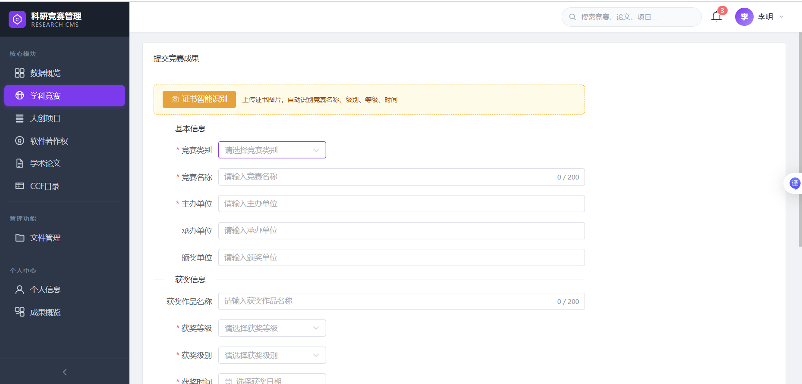{width="4.865277777777778in"
height="2.334722222222222in"}

图5.2 学科竞赛成果管理模块实现

代码清单5-4 CompetitionServiceImpl.java ---
竞赛成果创建与关键字搜索核心代码

> \@Override
>
> \@Transactional
>
> public CompetitionVO create(CompetitionDTO dto) {
>
> Competition competition = new Competition();
>
> BeanUtils.copyProperties(dto, competition);
>
> competition.setSubmitUserId(SecurityUtils.getCurrentUserId());
>
> competition.setStatus(\"pending_review\");
>
> competitionMapper.insert(competition);
>
> // Update file associations
>
> updateFileAssociations(competition.getId(), dto.getFileIds());
>
> // Record timeline event
>
> timelineService.addEvent(\"competition\", competition.getId(),
>
> \"submitted\", \"submit\", null);
>
> // Notify secretary role users
>
> notifySecretaries(\"新成果提交 - \" +
> competition.getCompetitionName(),
>
> \"学生提交了竞赛成果「\" + competition.getCompetitionName()
>
> \+ \"」，请及时审核。\",
>
> \"competition\", competition.getId());
>
> return convertToVO(competition);
>
> }
>
> // Keyword search: match BOTH competition_name AND work_name
>
> if (StringUtils.hasText(query.getKeyword())) {
>
> wrapper.and(w -\> w.like(Competition::getCompetitionName,
> query.getKeyword())
>
> .or()
>
> .like(Competition::getWorkName, query.getKeyword()));
>
> }
>
> // Update: only allow editing when status is pending_review or
> returned
>
> String status = competition.getStatus();
>
> if (!\"pending_review\".equals(status) &&
> !\"returned\".equals(status)) {
>
> throw new BusinessException(\"当前状态不允许编辑\");
>
> }

前端竞赛提交页面的核心逻辑实现在CompetitionForm.vue中。代码清单5-5展示了handleSave()方法，包含前端表单校验（ElForm.validate()）、重复性检测（checkDuplicate
API调用）、文件ID收集和API提交四个关键步骤。loadCompetition()方法在编辑模式下从后端加载已有数据并回填到表单的响应式对象中。

代码清单5-5 CompetitionForm.vue --- 前端表单提交处理逻辑

> const handleSave = async () =\> {
>
> const valid = await formRef.value.validate().catch(() =\> false)
>
> if (!valid) return
>
> // Duplicate check before submit
>
> try {
>
> const dupRes = await checkDuplicate({
>
> type: \'competition\', data: { \...form }
>
> })
>
> if (dupRes.data?.hasDuplicate) {
>
> await ElMessageBox.confirm(
>
> \'发现可能重复的成果，是否继续提交？\',
>
> \'重复警告\', {
>
> type: \'warning\',
>
> confirmButtonText: \'继续提交\',
>
> cancelButtonText: \'取消\'
>
> })
>
> }
>
> } catch { /\* user cancelled or network error \*/ }
>
> submitting.value = true
>
> try {
>
> const payload = { \...form, fileIds: fileList.value.map(f =\> f.id) }
>
> if (isEdit.value) {
>
> await updateCompetition(competitionId.value, payload)
>
> ElMessage.success(\'更新成功\')
>
> } else {
>
> await createCompetition(payload)
>
> ElMessage.success(\'提交成功\')
>
> }
>
> router.push(\'/competition\')
>
> } catch { /\* handled by Axios interceptor \*/ }
>
> finally { submitting.value = false }
>
> }

## 5.3 两级审核工作流模块实现

审核管理模块实现了\"秘书初审→领导终审\"的两级审核工作流，是系统业务流程的核心。ReviewServiceImpl类承担了审核通过（approve）和审核退回（reject）两个核心方法的实现。审核通过流程的关键逻辑：首先通过updateAchievementStatus()方法校验当前成果状态是否符合预期（秘书只能审核pending_review状态的成果，领导只能审核under_review状态的成果，使用严格的requiredCurrentStatus校验防止重复审核和越权操作），校验通过后将状态推进到下一阶段（秘书审批→under_review，领导审批→archived）。然后创建ReviewRecord审核记录并存档。最后通过timelineService记录时间线事件，并向提交者推送通知（秘书审批通过时同时通知学院领导进行下一步审核）。

代码清单5-6展示了审核状态更新的核心逻辑。通过switch语句根据不同的成果类型（competition/innovation/copyright/paper）查询对应的实体记录，校验当前状态是否符合该审核角色的要求，校验通过后更新状态并返回提交者ID。

俩级审核工作流模块实现如图5.3、图5.4所示。

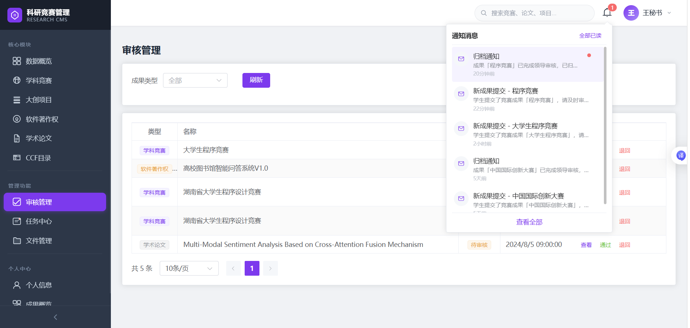{width="5.160416666666666in"
height="2.4604166666666667in"}

图5.3 秘书审核模块实现

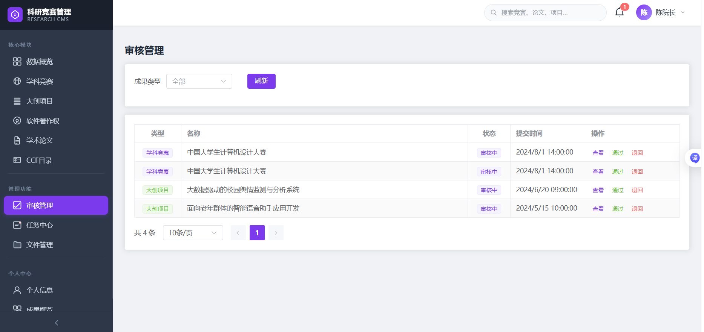{width="4.839583333333334in"
height="2.2895833333333333in"}

图5.4 领导审核模块实现

代码清单5-6 ReviewServiceImpl.java --- 审核状态更新与前置校验核心代码

> private Long updateAchievementStatus(String achievementType,
>
> Long achievementId, String userRole) {
>
> String newStatus;
>
> String requiredCurrentStatus;
>
> if (\"ROLE_SECRETARY\".equals(userRole)) {
>
> newStatus = \"under_review\";
>
> requiredCurrentStatus = \"pending_review\";
>
> } else if (\"ROLE_LEADER\".equals(userRole)) {
>
> newStatus = \"archived\";
>
> requiredCurrentStatus = \"under_review\";
>
> } else {
>
> throw new BusinessException(\"无权限执行审核操作\");
>
> }
>
> Long submitUserId;
>
> String currentStatus;
>
> switch (achievementType) {
>
> case \"competition\" -\> {
>
> Competition c = competitionMapper.selectById(achievementId);
>
> if (c == null) throw new BusinessException(\"竞赛成果不存在\");
>
> currentStatus = c.getStatus();
>
> submitUserId = c.getSubmitUserId();
>
> c.setStatus(newStatus);
>
> competitionMapper.updateById(c);
>
> }
>
> case \"innovation\" -\> {
>
> InnovationProject p = innovationMapper.selectById(achievementId);
>
> if (p == null) throw new BusinessException(\"创新项目不存在\");
>
> currentStatus = p.getStatus();
>
> submitUserId = p.getSubmitUserId();
>
> p.setStatus(newStatus);
>
> innovationMapper.updateById(p);
>
> }
>
> // \... similar for copyright and paper types
>
> default -\> throw new BusinessException(\"未知的成果类型\");
>
> }
>
> // Strict validation: prevent duplicate review
>
> if (!requiredCurrentStatus.equals(currentStatus)) {
>
> throw new BusinessException(\"当前成果状态不允许审核\");
>
> }
>
> return submitUserId;
>
> }

代码清单5-7展示了完整的审核通过（approve）方法。该方法在@Transactional(rollbackFor
=
Exception.class)事务保护下，依次完成状态更新、审核记录创建、时间线记录和双向通知推送（提交者获知审核结果，下一级审核人收到待办通知），确保审核流程的原子性和数据一致性。

代码清单5-7 ReviewServiceImpl.java --- 审核通过事务方法完整实现

> \@Override
>
> \@Transactional(rollbackFor = Exception.class)
>
> public void approve(ReviewDTO dto) {
>
> String userRole = SecurityUtils.getCurrentUserRole();
>
> Long userId = SecurityUtils.getCurrentUserId();
>
> // Step 1: Update achievement status
>
> Long submitUserId = updateAchievementStatus(
>
> dto.getAchievementType(), dto.getAchievementId(), userRole);
>
> // Step 2: Create review record
>
> ReviewRecord record = new ReviewRecord();
>
> record.setAchievementType(dto.getAchievementType());
>
> record.setAchievementId(dto.getAchievementId());
>
> record.setReviewerId(userId);
>
> record.setReviewLevel(
>
> \"ROLE_SECRETARY\".equals(userRole) ? \"secretary\" : \"leader\");
>
> record.setStatus(\"approved\");
>
> record.setComment(dto.getComment());
>
> record.setReviewTime(LocalDateTime.now());
>
> reviewRecordMapper.insert(record);
>
> // Step 3: Record timeline event
>
> timelineService.addEvent(dto.getAchievementType(),
>
> dto.getAchievementId(), reviewLevel + \"\_review\",
>
> \"approve\", dto.getComment());
>
> // Step 4: Create notifications
>
> String name = getAchievementName(
>
> dto.getAchievementType(), dto.getAchievementId());
>
> if (\"ROLE_SECRETARY\".equals(userRole)) {
>
> // Notify submitter + leader
>
> notifySubmitter(submitUserId, \"审核通过\", name);
>
> notifyRoleUsers(\"LEADER\", \"待审核通知\", name, \...);
>
> } else {
>
> // Notify submitter + secretary (archived)
>
> notifySubmitter(submitUserId, \"归档通知\", name);
>
> notifyRoleUsers(\"SECRETARY\", \"归档通知\", name, \...);
>
> }
>
> }

### 代码清单5-3 SecurityConfig.java --- Spring Security安全配置类

```java
@Configuration
@EnableWebSecurity
@EnableMethodSecurity
@RequiredArgsConstructor
public class SecurityConfig {

    private final JwtAuthenticationFilter jwtAuthenticationFilter;

    @Bean
    public SecurityFilterChain filterChain(HttpSecurity http) throws Exception {
        http
            .cors(cors -> cors.configurationSource(corsConfigurationSource()))
            .csrf(csrf -> csrf.disable())
            .sessionManagement(session ->
                session.sessionCreationPolicy(SessionCreationPolicy.STATELESS))
            .authorizeHttpRequests(auth -> auth
                .requestMatchers("/api/auth/login").permitAll()
                .requestMatchers("/api/admin/**").hasRole("ADMIN")
                .requestMatchers(HttpMethod.POST, "/api/review/**")
                    .hasAnyRole("ADMIN", "SECRETARY", "LEADER")
                .anyRequest().authenticated()
            )
            .addFilterBefore(jwtAuthenticationFilter,
                UsernamePasswordAuthenticationFilter.class);
        return http.build();
    }

    @Bean
    public PasswordEncoder passwordEncoder() {
        return new BCryptPasswordEncoder();
    }

    @Bean
    public CorsConfigurationSource corsConfigurationSource() {
        CorsConfiguration config = new CorsConfiguration();
        config.setAllowedOriginPatterns(List.of("http://localhost:*"));
        config.setAllowedMethods(List.of("GET","POST","PUT","DELETE","OPTIONS"));
        config.setAllowedHeaders(List.of("*"));
        config.setAllowCredentials(true);
        UrlBasedCorsConfigurationSource source = new UrlBasedCorsConfigurationSource();
        source.registerCorsConfiguration("/**", config);
        return source;
    }
}
```

---

## 5.2 学科竞赛成果管理模块实现

学科竞赛成果管理模块是本系统最核心的业务模块，涉及完整的CRUD操作和前后端数据交互。模块的类结构设计如下：

- **Competition实体类**：@TableName("competition_achievement")，与数据库表映射
- **CompetitionDTO**：前端提交的数据传输对象，包含Jakarta Bean Validation校验注解，如@NotBlank(message = "竞赛名称不能为空")
- **CompetitionVO**：返回给前端的视图对象，通过BeanUtils.copyProperties从实体复制属性后，额外填充submitUserName和关联文件列表files
- **CompetitionQueryDTO**：分页查询参数对象，包含page、size、category、level、grade、status、keyword、year等过滤字段
- **CompetitionServiceImpl**：核心业务逻辑实现类，注入CompetitionMapper、SysUserMapper、SysFileMapper、TimelineService和NotificationMapper五个依赖

创建竞赛成果的核心流程在create()方法中实现。代码清单5-4展示了完整的创建逻辑，包含数据持久化、文件关联、时间线记录和通知推送四个步骤，全部在@Transactional事务保护下执行。特别需要注意的是关键字搜索功能通过wrapper.and()嵌套or()条件实现同时对competition_name和work_name两个字段的模糊匹配。学科竞赛成果管理模块实现如图5.2所示。

{width="4.865277777777778in" height="2.334722222222222in"}

**图5.2 学科竞赛成果管理模块实现**

### 代码清单5-4 CompetitionServiceImpl.java --- 竞赛成果创建与关键字搜索核心代码

```java
@Override
@Transactional
public CompetitionVO create(CompetitionDTO dto) {
    Competition competition = new Competition();
    BeanUtils.copyProperties(dto, competition);
    competition.setSubmitUserId(SecurityUtils.getCurrentUserId());
    competition.setStatus("pending_review");
    competitionMapper.insert(competition);

    // Update file associations
    updateFileAssociations(competition.getId(), dto.getFileIds());

    // Record timeline event
    timelineService.addEvent("competition", competition.getId(),
        "submitted", "submit", null);

    // Notify secretary role users
    notifySecretaries("新成果提交 - " + competition.getCompetitionName(),
        "学生提交了竞赛成果「" + competition.getCompetitionName()
        + "」，请及时审核。",
        "competition", competition.getId());

    return convertToVO(competition);
}

// Keyword search: match BOTH competition_name AND work_name
if (StringUtils.hasText(query.getKeyword())) {
    wrapper.and(w -> w.like(Competition::getCompetitionName, query.getKeyword())
        .or()
        .like(Competition::getWorkName, query.getKeyword()));
}

// Update: only allow editing when status is pending_review or returned
String status = competition.getStatus();
if (!"pending_review".equals(status) &&
    !"returned".equals(status)) {
    throw new BusinessException("当前状态不允许编辑");
}
```

前端竞赛提交页面的核心逻辑实现在CompetitionForm.vue中。代码清单5-5展示了handleSave()方法，包含前端表单校验（ElForm.validate()）、重复性检测（checkDuplicate API调用）、文件ID收集和API提交四个关键步骤。loadCompetition()方法在编辑模式下从后端加载已有数据并回填到表单的响应式对象中。

### 代码清单5-5 CompetitionForm.vue --- 前端表单提交处理逻辑

```javascript
const handleSave = async () => {
    const valid = await formRef.value.validate().catch(() => false)
    if (!valid) return

    // Duplicate check before submit
    try {
        const dupRes = await checkDuplicate({
            type: 'competition', data: { ...form }
        })
        if (dupRes.data?.hasDuplicate) {
            await ElMessageBox.confirm(
                '发现可能重复的成果，是否继续提交？',
                '重复警告', {
                type: 'warning',
                confirmButtonText: '继续提交',
                cancelButtonText: '取消'
            })
        }
    } catch { /* user cancelled or network error */ }

    submitting.value = true
    try {
        const payload = { ...form, fileIds: fileList.value.map(f => f.id) }
        if (isEdit.value) {
            await updateCompetition(competitionId.value, payload)
            ElMessage.success('更新成功')
        } else {
            await createCompetition(payload)
            ElMessage.success('提交成功')
        }
        router.push('/competition')
    } catch { /* handled by Axios interceptor */ }
    finally { submitting.value = false }
}
```

---

## 5.3 两级审核工作流模块实现

审核管理模块实现了"秘书初审→领导终审"的两级审核工作流，是系统业务流程的核心。ReviewServiceImpl类承担了审核通过（approve）和审核退回（reject）两个核心方法的实现。

审核通过流程的关键逻辑：

1. 首先通过updateAchievementStatus()方法校验当前成果状态是否符合预期（秘书只能审核pending_review状态的成果，领导只能审核under_review状态的成果，使用严格的requiredCurrentStatus校验防止重复审核和越权操作）
2. 校验通过后将状态推进到下一阶段（秘书审批→under_review，领导审批→archived）
3. 然后创建ReviewRecord审核记录并存档
4. 最后通过timelineService记录时间线事件，并向提交者推送通知（秘书审批通过时同时通知学院领导进行下一步审核）

代码清单5-6展示了审核状态更新的核心逻辑。通过switch语句根据不同的成果类型（competition/innovation/copyright/paper）查询对应的实体记录，校验当前状态是否符合该审核角色的要求，校验通过后更新状态并返回提交者ID。两级审核工作流模块实现如图5.3、图5.4所示。

{width="5.160416666666666in" height="2.4604166666666667in"}

**图5.3 秘书审核模块实现**

{width="4.839583333333334in" height="2.2895833333333333in"}

**图5.4 领导审核模块实现**

### 代码清单5-6 ReviewServiceImpl.java --- 审核状态更新与前置校验核心代码

```java
private Long updateAchievementStatus(String achievementType,
        Long achievementId, String userRole) {
    String newStatus;
    String requiredCurrentStatus;

    if ("ROLE_SECRETARY".equals(userRole)) {
        newStatus = "under_review";
        requiredCurrentStatus = "pending_review";
    } else if ("ROLE_LEADER".equals(userRole)) {
        newStatus = "archived";
        requiredCurrentStatus = "under_review";
    } else {
        throw new BusinessException("无权限执行审核操作");
    }

    Long submitUserId;
    String currentStatus;

    switch (achievementType) {
        case "competition" -> {
            Competition c = competitionMapper.selectById(achievementId);
            if (c == null) throw new BusinessException("竞赛成果不存在");
            currentStatus = c.getStatus();
            submitUserId = c.getSubmitUserId();
            c.setStatus(newStatus);
            competitionMapper.updateById(c);
        }
        case "innovation" -> {
            InnovationProject p = innovationMapper.selectById(achievementId);
            if (p == null) throw new BusinessException("创新项目不存在");
            currentStatus = p.getStatus();
            submitUserId = p.getSubmitUserId();
            p.setStatus(newStatus);
            innovationMapper.updateById(p);
        }
        // ... similar for copyright and paper types
        default -> throw new BusinessException("未知的成果类型");
    }

    // Strict validation: prevent duplicate review
    if (!requiredCurrentStatus.equals(currentStatus)) {
        throw new BusinessException("当前成果状态不允许审核");
    }

    return submitUserId;
}
```

### 代码清单5-7 ReviewServiceImpl.java --- 审核通过事务方法完整实现

```java
@Override
@Transactional(rollbackFor = Exception.class)
public void approve(ReviewDTO dto) {
    String userRole = SecurityUtils.getCurrentUserRole();
    Long userId = SecurityUtils.getCurrentUserId();

    // Step 1: Update achievement status
    Long submitUserId = updateAchievementStatus(
        dto.getAchievementType(), dto.getAchievementId(), userRole);

    // Step 2: Create review record
    ReviewRecord record = new ReviewRecord();
    record.setAchievementType(dto.getAchievementType());
    record.setAchievementId(dto.getAchievementId());
    record.setReviewerId(userId);
    record.setReviewLevel(
        "ROLE_SECRETARY".equals(userRole) ? "secretary" : "leader");
    record.setStatus("approved");
    record.setComment(dto.getComment());
    record.setReviewTime(LocalDateTime.now());
    reviewRecordMapper.insert(record);

    // Step 3: Record timeline event
    timelineService.addEvent(dto.getAchievementType(),
        dto.getAchievementId(), reviewLevel + "_review",
        "approve", dto.getComment());

    // Step 4: Create notifications
    String name = getAchievementName(
        dto.getAchievementType(), dto.getAchievementId());
    if ("ROLE_SECRETARY".equals(userRole)) {
        // Notify submitter + leader
        notifySubmitter(submitUserId, "审核通过", name);
        notifyRoleUsers("LEADER", "待审核通知", name, ...);
    } else {
        // Notify submitter + secretary (archived)
        notifySubmitter(submitUserId, "归档通知", name);
        notifyRoleUsers("SECRETARY", "归档通知", name, ...);
    }
}
```

---

### 代码清单5-10 DuplicateCheckController.java --- 论文重复检测逻辑

```java
@PostMapping("/duplicate")
public Result<Map<String, Object>> checkDuplicate(@RequestBody Map<String, Object> body) {
    String type = (String) body.get("type");
    Map<String, Object> data = (Map<String, Object>) body.get("data");
    List<Map<String, Object>> duplicates = new ArrayList<>();

    switch (type) {
        case "paper" -> {
            String title = (String) data.get("title");
            String journal = (String) data.get("journalName");
            LambdaQueryWrapper<AcademicPaper> qw = new LambdaQueryWrapper<>();
            qw.eq(AcademicPaper::getTitle, title);
            if (journal != null && !journal.isEmpty()) {
                qw.eq(AcademicPaper::getJournalName, journal);
            }
            List<AcademicPaper> list = paperMapper.selectList(qw);
            for (AcademicPaper p : list) {
                Map<String, Object> d = new LinkedHashMap<>();
                d.put("id", p.getId());
                d.put("name", p.getTitle());
                d.put("status", p.getStatus());
                duplicates.add(d);
            }
        }
        // ... 其他类型处理（competition/innovation/copyright）
    }

    Map<String, Object> result = new LinkedHashMap<>();
    result.put("hasDuplicate", !duplicates.isEmpty());
    result.put("duplicates", duplicates);
    return Result.ok(result);
}
```

### 代码清单5-11 PaperForm.vue --- CCF期刊匹配调用

```javascript
const handleJournalInput = async () => {
    if (!form.journalName) {
        form.journalLevel = ''
        return
    }

    try {
        const res = await request.get('/api/ccf/match', {
            params: { name: form.journalName }
        })
        if (res.data) {
            form.journalLevel = res.data.level // 自动填充级别(A/B/C)
            ElMessage.success(`已匹配到CCF ${res.data.level}类期刊：${res.data.fullName}`)
        }
    } catch (e) {
        console.log('未匹配到CCF期刊')
    }
}
```

**解析策略说明**：重复检测采用标题与期刊名称组合精确匹配，精准识别已有重复记录；CCF期刊匹配结合全称模糊查询与缩写精确查询，并按照期刊级别排序择优返回结果。两种匹配方式分别适配成果防重、期刊等级识别的不同业务场景，兼顾数据准确性与使用便捷性。

---

## 5.6 文件导出功能模块实现

文件导出模块包含科研成果CSV导出、用户Excel模板下载与批量导入、通用文件下载及预览功能，采用前后端分离架构开发。个人中心支持将四类科研成果聚合导出为CSV文件，后端汇总多表数据并做字符转义、编码兼容处理；管理员端借助EasyExcel实现Excel模板生成、文件解析与数据校验；通用文件模块根据后缀区分预览与下载模式，适配图片、PDF等常见附件格式。模块增加接口权限校验、文件格式过滤、参数合法性校验等安全机制，保障文件操作安全。文件导出功能模块实现如图5.7所示。

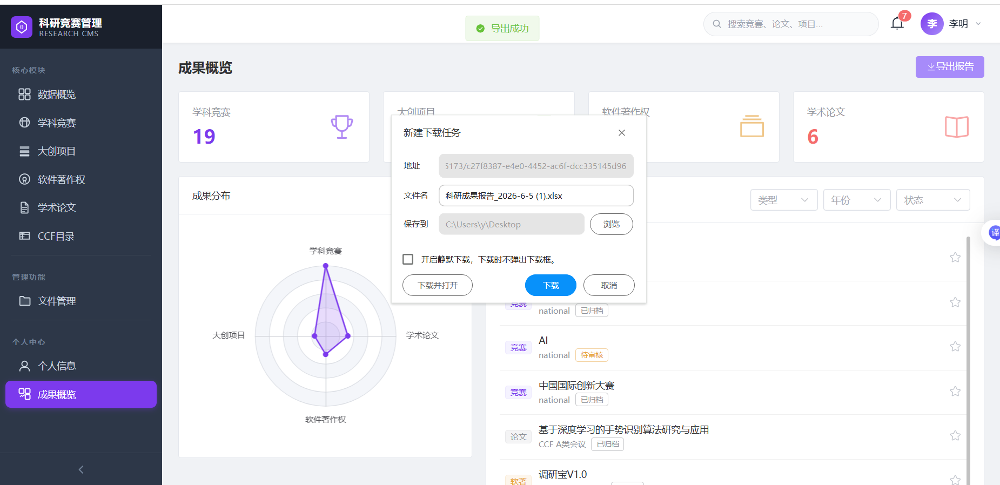{width="4.045833333333333in" height="1.9416666666666667in"}

**图5.7 文件导出功能模块实现**

### 代码清单5-12 PersonalCenterController.java --- 科研成果CSV导出核心代码

```java
@GetMapping("/export")
public void export(HttpServletResponse response) throws Exception {
    Long userId = SecurityUtils.getCurrentUserId();
    List<Map<String, Object>> allRecords = new ArrayList<>();

    // 分别查询竞赛、大创、软著、论文四类成果
    LambdaQueryWrapper<Competition> compQw = new LambdaQueryWrapper<>();
    compQw.eq(Competition::getSubmitUserId, userId);
    // 省略其余三类成果查询与数据组装逻辑

    // 配置响应头，输出UTF-8编码CSV文件
    response.setContentType("text/csv;charset=UTF-8");
    response.setHeader("Content-Disposition", "attachment; filename*=UTF-8''" +
        URLEncoder.encode("科研成果报告.csv", "UTF-8").replace("+", "%20"));

    PrintWriter writer = response.getWriter();
    writer.write("\uFEFF"); // 写入BOM头解决Excel中文乱码
    writer.println("序号,成果类型,成果名称,级别,等级,时间,状态");

    // 遍历数据写入文件，特殊字符转义
    for (int i = 0; i < allRecords.size(); i++) {
        // 省略逐行写入逻辑
    }

    writer.flush();
}

// CSV特殊字符转义工具方法
private String csv(String val) {
    if (val.contains(",") || val.contains("\"") || val.contains("\n")) {
        return "\"" + val.replace("\"", "\"\"") + "\"";
    }
    return val;
}
```

**导出与文件操作策略说明**：成果导出采用多表数据聚合方式生成CSV文件，通过BOM头与字符转义解决中文、特殊符号显示异常问题；用户导入功能基于EasyExcel实现流式解析，有效规避大文件造成的内存溢出问题，并严格校验文件格式与数据内容；文件模块依据扩展名区分在线预览和强制下载逻辑。同时模块通过角色权限注解、文件类型拦截、URL编码处理等方式，防范越权访问、非法文件上传、中文文件名乱码等问题，保障系统安全稳定运行。

---

## 5.7 系统主要功能页面展示

以下为系统主要功能模块的运行页面说明与截图展示。所有页面截图需在实际运行环境中截取后替换占位符。

### （1）登录页面

系统入口页面，用户在表单中输入用户名和密码进行身份认证。页面采用居中卡片式布局，背景使用渐变色设计。系统内置四个测试账号：

- admin（管理员）
- student1（学生）
- secretary（科研秘书）
- leader（学院领导）

默认密码为账号后加123（如admin123）。登录页面如图5.8所示。

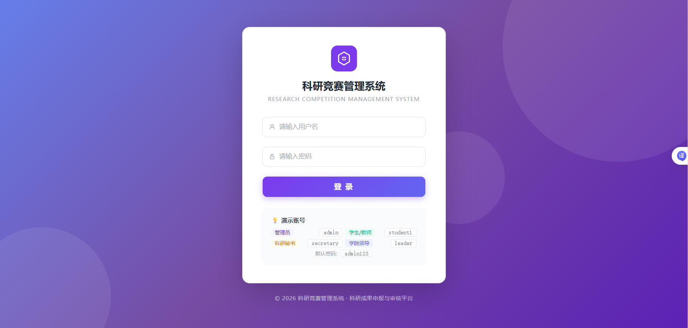{width="5.276388888888889in" height="2.5131944444444443in"}

**图5.8 系统登录页面**

### （2）数据概览仪表盘

系统首页（DashboardView.vue），展示全局KPI统计卡片（学科竞赛、大创项目、软件著作权、学术论文的各类总数）、成果分类分布图表和月度提交趋势图。右侧展示最新系统公告列表。图表采用vue-echarts（Apache ECharts 5）进行渲染，支持响应式自适应布局。数据概览仪表盘界面如图5.9所示。

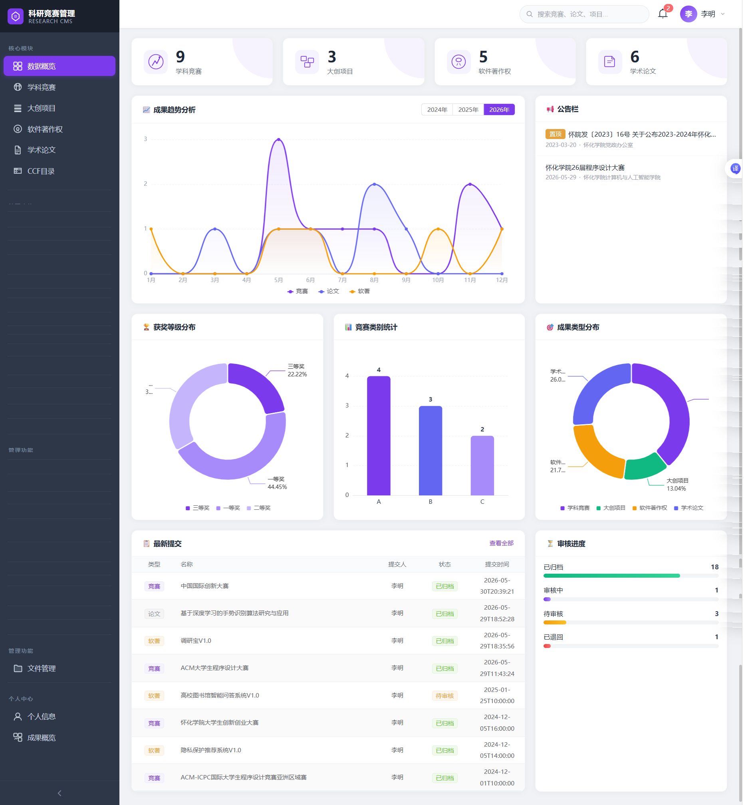{width="4.4215277777777775in" height="4.783333333333333in"}

**图5.9 数据概览仪表盘**

### （3）竞赛成果提交页面

竞赛成果提交页面（CompetitionForm.vue）包含竞赛基本信息（类别、名称、主办/承办/颁奖单位）、获奖信息（获奖作品名称、等级、级别、时间）和人员信息（指导教师、参与学生）三个分区的表单。页面顶部集成OCR智能识别按钮（黄色高亮区域），点击后弹出OCR对话框。表单底部提供多文件上传功能，支持拖拽上传。竞赛成果提交页面如图5.10所示。

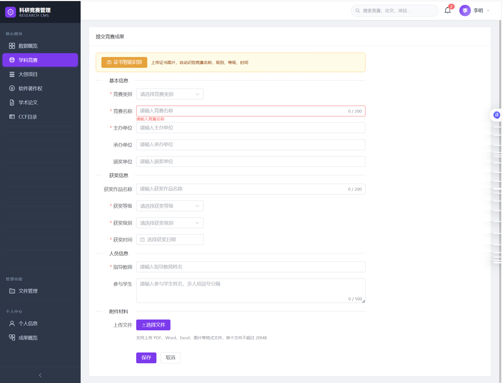{width="4.0256944444444445in" height="3.061111111111111in"}

**图5.10 竞赛成果提交页面**

### （4）OCR证书识别对话框

左侧为证书图片上传和预览区域（支持点击或拖拽上传JPG/PNG/BMP格式图片），右侧为识别结果展示面板。结果面板从上到下依次显示：

- 识别原始文本（灰色背景区域）
- 竞赛名称（可编辑输入框）
- 获奖作品名称（可编辑输入框）
- 获奖等级和获奖级别（下拉选择框）
- 获奖时间（日期选择器）

底部提供"应用到表单"按钮。识别进度在按钮上以百分比形式实时显示。OCR证书智能识别对话框如图5.11所示。

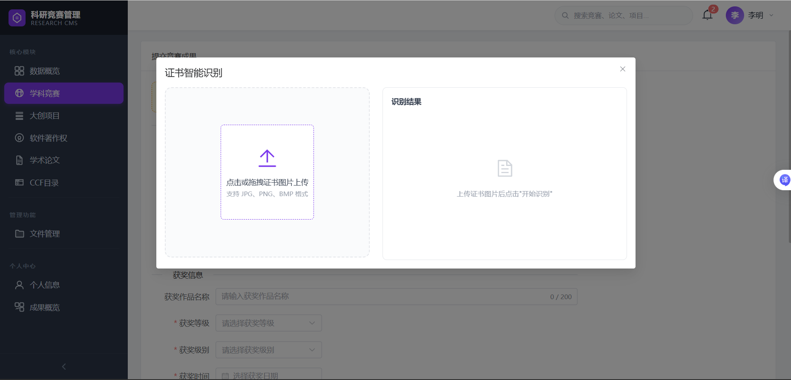{width="4.647222222222222in" height="2.234722222222222in"}

**图5.11 OCR证书智能识别对话框**

### （5）审核管理页面

秘书/领导查看待审核成果列表，支持按成果类型（竞赛/大创/软著/论文）筛选。每条成果显示类型标签、标题、提交人、提交时间和审核状态。点击"审核"按钮弹出审核对话框，可填写审核意见后选择"通过"（绿色按钮）或"退回"（红色按钮）。列表项点击可直接跳转到成果详情页查看完整信息。审核管理页面如图5.12所示。

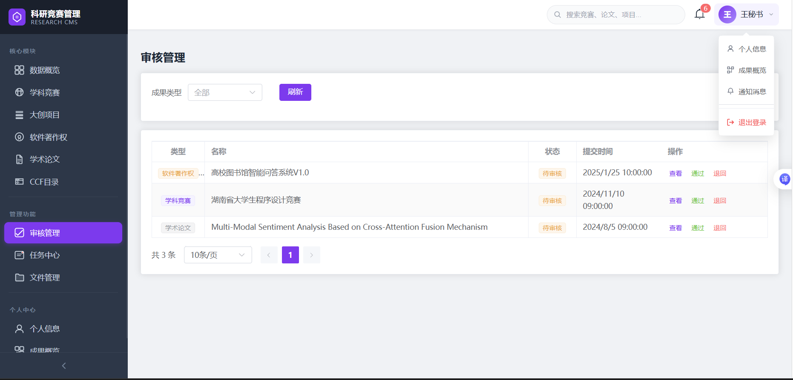{width="5.105555555555555in" height="2.448611111111111in"}

**图5.12 审核管理页面**

### （6）个人成果中心

页面顶部展示四类成果的统计卡片（带彩色图标）。左侧为成果分布雷达图（vue-echarts渲染），右侧为成果列表，支持按类型、年份和审核状态进行三维筛选。每项成果显示类型标签、标题（竞赛类优先展示获奖作品名称workName）、级别和审核状态标签。右侧提供五角星置顶/取消置顶按钮。页面右上角提供"导出报告"按钮，点击后自动下载CSV格式的科研成果报告文件。个人成果中心页面如图5.13所示。

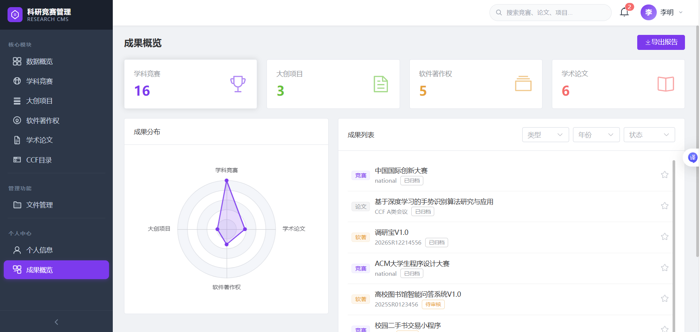{width="5.739583333333333in" height="2.7291666666666665in"}

**图5.13 个人成果中心**

### （7）系统管理后台（管理员专有）

用户管理页面（UserManage.vue）展示所有用户的列表，支持按角色筛选。每行显示用户名、真实姓名、角色标签和账户状态开关。管理员可进行新增用户、编辑用户信息、分配角色和启用/禁用账户等操作。系统公告管理页面支持发布富文本公告，公告将显示在所有用户的仪表盘首页。用户管理页面如图5.14所示。

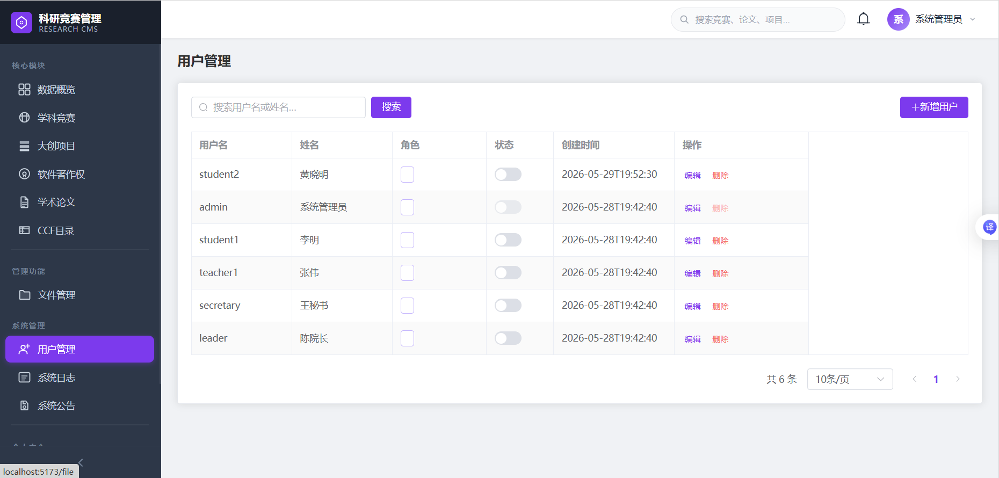{width="5.754166666666666in" height="2.7534722222222223in"}

**图5.14 系统管理后台 - 用户管理**

---

# 第6章 系统测试

## 6.1 测试环境

### 表6-1 系统测试环境配置

OCR智能识别模块是系统的创新特色功能，完全在前端浏览器环境中运行，实现在CompetitionForm.vue组件的OCR对话框区域中。

OCR识别流程如下：

1. 用户点击"证书智能识别"按钮打开OCR对话框
2. 上传证书图片（JPG/PNG/BMP格式）
3. 浏览器通过URL.createObjectURL()生成图片本地预览
4. 点击"开始识别"按钮
5. 系统通过动态导入（import("tesseract.js")）加载Tesseract.js库
6. 调用Tesseract.recognize(certImageUrl, "chi_sim+eng", {logger})方法进行中英文混合识别
7. logger回调函数实时更新识别进度（0%~100%）
8. 识别完成后获取原始文本（result.data.text.trim()）
9. 调用parseOcrText()函数进行正则表达式结构化解析
10. 提取的字段展示在右侧结果面板中
11. 用户确认后点击"应用到表单"将字段值回填到提交表单[^14]

代码清单5-8展示了OCR识别引擎的调用逻辑（runOcr方法），包括Tesseract.js的动态导入、语言包配置、进度回调和错误处理。前端OCR智能识别模块实现如图5.5所示。

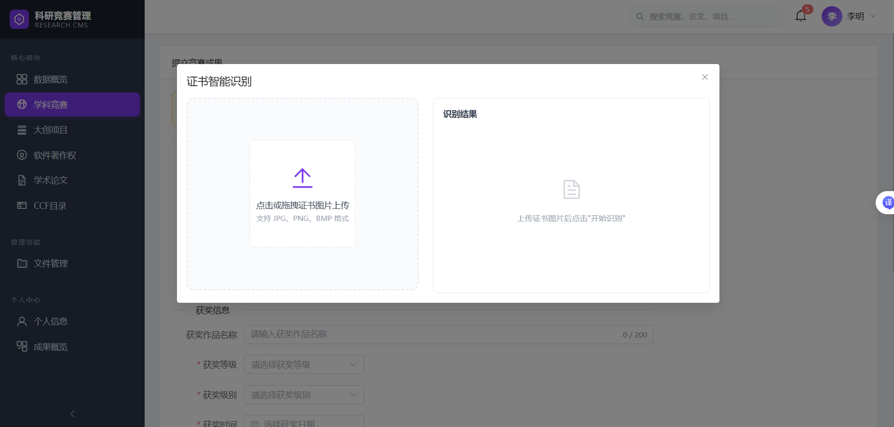{width="4.624305555555556in" height="2.2125in"}

**图5.5 前端OCR智能识别模块实现**

### 代码清单5-8 CompetitionForm.vue --- Tesseract.js OCR识别引擎调用

```javascript
const runOcr = async () => {
    if (!certImageUrl.value) {
        ocrError.value = '请先上传证书图片'
        return
    }

    ocrLoading.value = true
    ocrProgress.value = 0
    ocrError.value = ''
    ocrRawText.value = ''

    try {
        // Dynamically import tesseract.js (browser-side OCR)
        const Tesseract = await import('tesseract.js')
        const result = await Tesseract.recognize(
            certImageUrl.value, 'chi_sim+eng', {
            logger: (m) => {
                if (m.status === 'recognizing text') {
                    ocrProgress.value = Math.round(m.progress * 100)
                }
            }
        })

        ocrRawText.value = result.data.text.trim()
        ocrProgress.value = 100

        if (!ocrRawText.value) {
            ocrError.value = '未能识别到文字，请确认图片清晰度或手动填写'
            return
        }

        // Parse recognized text to extract fields
        parseOcrText(ocrRawText.value)
    } catch (e) {
        ocrError.value = 'OCR识别失败：' + (e.message || '未知错误')
    } finally {
        ocrLoading.value = false
    }
}
```

### 代码清单5-9 CompetitionForm.vue --- OCR文本字段解析与映射逻辑

```javascript
const parseOcrText = (text) => {
    certForm.competitionName = ''
    certForm.workName = ''
    certForm.awardLevel = ''
    certForm.awardGrade = ''
    certForm.awardTime = ''
    ocrFieldsFound.value = 0

    // --- Competition Name ---
    const namePatterns = [
        /竞赛名称[:：]\s*(.+?)(?:[\n\r]|$)/,
        /([\u4e00-\u9fff]+(?:大赛|竞赛|挑战赛|联赛|比赛))/,
        /第[\u4e00-\u9fff\d]+届\s*([\u4e00-\u9fff]+(?:大赛|竞赛|挑战赛))/
    ]

    for (const p of namePatterns) {
        const m = text.match(p)
        if (m) { 
            certForm.competitionName = m[1].trim()
            ocrFieldsFound.value++
            break 
        }
    }

    // --- Work Name (获奖作品名称) ---
    const workNamePatterns = [
        /作品名称[:：]\s*(.+?)(?:[\n\r]|$)/,
        /项目名称[:：]\s*(.+?)(?:[\n\r]|$)/,
        /获奖作品[:：]\s*(.+?)(?:[\n\r]|$)/
    ]

    for (const p of workNamePatterns) {
        const m = text.match(p)
        if (m) { 
            certForm.workName = m[1].trim()
            ocrFieldsFound.value++
            break 
        }
    }

    // --- Award Level & Grade (mapping keywords to codes) ---
    if (/国家级/.test(text)) certForm.awardLevel = 'national'
    else if (/省(?:级|赛)/.test(text)) certForm.awardLevel = 'provincial'
    // ... (municipal/school/college)

    if (/一等奖/.test(text)) certForm.awardGrade = 'first'
    else if (/二等奖/.test(text)) certForm.awardGrade = 'second'
    else if (/三等奖/.test(text)) certForm.awardGrade = 'third'

    // --- Award Time (date format matching) ---
    const m = text.match(/(\d{4}[年.-]\d{1,2}[月.-]\d{1,2}[日]?)/)
    if (m) certForm.awardTime = m[1].replace(/[年月]/g, '-').replace(/日/g, '')
}
```

**解析策略说明**：parseOcrText()函数依次执行三组正则表达式匹配。首先通过namePatterns匹配竞赛名称，优先匹配显式标签（如"竞赛名称：全国大学生数学建模竞赛"），其次匹配含竞赛关键词的短语。然后通过workNamePatterns匹配获奖作品名称，优先匹配"作品名称："标签。接着通过关键词匹配确定获奖等级（国家级/省级等）和获奖级别（一等奖/二等奖等），使用JavaScript的RegExp.test()方法进行关键词扫描。最后通过日期正则表达式匹配YYYY年MM月DD日或YYYY-MM-DD格式的获奖时间。提取到的所有字段累加ocrFieldsFound计数器，用于在OCR结果面板中显示"已识别N个字段"的标签。

---

## 5.5 论文匹配模块实现

论文匹配模块分为重复检测与CCF期刊匹配两大功能。重复检测在提交成果时调用后端接口，基于标题、期刊名称执行精确匹配校验重复数据，前端检测到重复后弹出提示框由用户确认后续操作；CCF期刊匹配可根据用户输入内容，对期刊全称做模糊匹配、缩写做精确匹配，自动识别期刊等级并回填至表单。模块借助MyBatis-Plus构建查询语句防范SQL注入，同时依托Spring Security实现接口权限管控，保障功能安全稳定运行。论文匹配模块实现如图5.6所示。

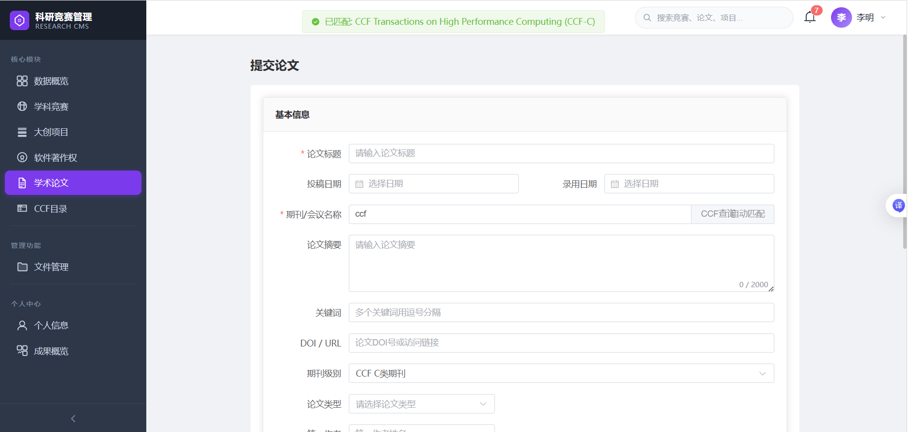{width="4.877777777777778in" height="0.6152777777777778in"}

**图5.6 论文匹配模块实现**

{width="4.624305555555556in"
height="2.2125in"}

图5.5 前端OCR智能识别模块实现

代码清单5-8 CompetitionForm.vue --- Tesseract.js OCR识别引擎调用

> const runOcr = async () =\> {
>
> if (!certImageUrl.value) {
>
> ocrError.value = \'请先上传证书图片\'
>
> return
>
> }
>
> ocrLoading.value = true
>
> ocrProgress.value = 0
>
> ocrError.value = \'\'
>
> ocrRawText.value = \'\'
>
> try {
>
> // Dynamically import tesseract.js (browser-side OCR)
>
> const Tesseract = await import(\'tesseract.js\')
>
> const result = await Tesseract.recognize(
>
> certImageUrl.value, \'chi_sim+eng\', {
>
> logger: (m) =\> {
>
> if (m.status === \'recognizing text\') {
>
> ocrProgress.value = Math.round(m.progress \* 100)
>
> }
>
> }
>
> })
>
> ocrRawText.value = result.data.text.trim()
>
> ocrProgress.value = 100
>
> if (!ocrRawText.value) {
>
> ocrError.value = \'未能识别到文字，请确认图片清晰度或手动填写\'
>
> return
>
> }
>
> // Parse recognized text to extract fields
>
> parseOcrText(ocrRawText.value)
>
> } catch (e) {
>
> ocrError.value = \'OCR识别失败：\' + (e.message \|\| \'未知错误\')
>
> } finally {
>
> ocrLoading.value = false
>
> }
>
> }

代码清单5-9展示了OCR文本的结构化解析逻辑（parseOcrText函数）。系统定义了三组正则表达式匹配模式：竞赛名称匹配\"竞赛名称：XXX\"模式及含\"大赛/竞赛/挑战赛\"关键词的短语；获奖作品名称匹配\"作品名称：XXX\"、\"项目名称：XXX\"、\"获奖作品：XXX\"模式；获奖等级和级别通过提取关键词（国家级/一等奖等）映射为系统内部编码。

代码清单5-9 CompetitionForm.vue --- OCR文本字段解析与映射逻辑

> const parseOcrText = (text) =\> {
>
> certForm.competitionName = \'\'
>
> certForm.workName = \'\'
>
> certForm.awardLevel = \'\'
>
> certForm.awardGrade = \'\'
>
> certForm.awardTime = \'\'
>
> ocrFieldsFound.value = 0
>
> // \-\-- Competition Name \-\--
>
> const namePatterns = \[
>
> /竞赛名称\[：:\]\\s\*(.+?)(?:\[\\n\\r\]\|\$)/,
>
> /(\[一-龥\]+(?:大赛\|竞赛\|挑战赛\|联赛\|比赛))/,
>
> /第\[一二三四五六七八九十\\d\]+届\\s\*(\[一-龥\]+(?:大赛\|竞赛\|挑战赛))/
>
> \]
>
> for (const p of namePatterns) {
>
> const m = text.match(p)
>
> if (m) { certForm.competitionName = m\[1\].trim();
> ocrFieldsFound.value++; break }
>
> }
>
> // \-\-- Work Name (获奖作品名称) \-\--
>
> const workNamePatterns = \[
>
> /作品名称\[：:\]\\s\*(.+?)(?:\[\\n\\r\]\|\$)/,
>
> /项目名称\[：:\]\\s\*(.+?)(?:\[\\n\\r\]\|\$)/,
>
> /获奖作品\[：:\]\\s\*(.+?)(?:\[\\n\\r\]\|\$)/
>
> \]
>
> for (const p of workNamePatterns) {
>
> const m = text.match(p)
>
> if (m) { certForm.workName = m\[1\].trim(); ocrFieldsFound.value++;
> break }
>
> }
>
> // \-\-- Award Level & Grade (mapping keywords to codes) \-\--
>
> if (/国家级/.test(text)) certForm.awardLevel = \'national\'
>
> else if (/省(级\|赛)/.test(text)) certForm.awardLevel = \'provincial\'
>
> // \... (municipal/school/college)
>
> if (/一等奖/.test(text)) certForm.awardGrade = \'first\'
>
> else if (/二等奖/.test(text)) certForm.awardGrade = \'second\'
>
> else if (/三等奖/.test(text)) certForm.awardGrade = \'third\'
>
> // \-\-- Award Time (date format matching) \-\--
>
> const m =
> text.match(/(\\d{4}\[年.-\]\\d{1,2}\[月.-\]\\d{1,2}\[日\]?)/)
>
> if (m) certForm.awardTime = m\[1\].replace(/\[年月\]/g,
> \'-\').replace(/日/g, \'\')
>
> }

解析策略说明：parseOcrText()函数依次执行三组正则表达式匹配。首先通过namePatterns匹配竞赛名称，优先匹配显式标签（如\"竞赛名称：全国大学生数学建模竞赛\"），其次匹配含竞赛关键词的短语。然后通过workNamePatterns匹配获奖作品名称，优先匹配\"作品名称：\"标签。接着通过关键词匹配确定获奖等级（国家级/省级等）和获奖级别（一等奖/二等奖等），使用JavaScript的RegExp.test()方法进行关键词扫描。最后通过日期正则表达式匹配YYYY年MM月DD日或YYYY-MM-DD格式的获奖时间。提取到的所有字段累加ocrFieldsFound计数器，用于在OCR结果面板中显示\"已识别N个字段\"的标签。

## 5.5论文匹配模块实现

论文匹配模块分为重复检测与CCF期刊匹配两大功能。重复检测在提交成果时调用后端接口，基于标题、期刊名称执行精确匹配校验重复数据，前端检测到重复后弹出提示框由用户确认后续操作；CCF期刊匹配可根据用户输入内容，对期刊全称做模糊匹配、缩写做精确匹配，自动识别期刊等级并回填至表单。模块借助MyBatis-Plus构建查询语句防范SQL注入，同时依托Spring
Security实现接口权限管控，保障功能安全稳定运行。论文匹配模块实现如图5.6所示。

{width="4.877777777777778in"
height="0.6152777777777778in"}

图5.6 论文匹配模块实现

代码清单5-10 DuplicateCheckController.java --- 论文重复检测逻辑

> \@PostMapping(\"/duplicate\")
>
> public Result\<Map\<String, Object\>\> checkDuplicate(@RequestBody
> Map\<String, Object\> body) {
>
> String type = (String) body.get(\"type\");
>
> Map\<String, Object\> data = (Map\<String, Object\>)
> body.get(\"data\");
>
> List\<Map\<String, Object\>\> duplicates = new ArrayList\<\>();
>
> switch (type) {
>
> case \"paper\" -\> {
>
> String title = (String) data.get(\"title\");
>
> String journal = (String) data.get(\"journalName\");
>
> LambdaQueryWrapper\<AcademicPaper\> qw = new LambdaQueryWrapper\<\>();
>
> qw.eq(AcademicPaper::getTitle, title);
>
> if (journal != null && !journal.isEmpty()) {
>
> qw.eq(AcademicPaper::getJournalName, journal);
>
> }
>
> List\<AcademicPaper\> list = paperMapper.selectList(qw);
>
> for (AcademicPaper p : list) {
>
> Map\<String, Object\> d = new LinkedHashMap\<\>();
>
> d.put(\"id\", p.getId());
>
> d.put(\"name\", p.getTitle());
>
> d.put(\"status\", p.getStatus());
>
> duplicates.add(d);
>
> }
>
> }
>
> // \... 其他类型处理（competition/innovation/copyright）
>
> }
>
> Map\<String, Object\> result = new LinkedHashMap\<\>();
>
> result.put(\"hasDuplicate\", !duplicates.isEmpty());
>
> result.put(\"duplicates\", duplicates);
>
> return Result.ok(result);
>
> }

代码清单5-11 PaperForm.vue --- CCF期刊匹配调用

> const handleJournalInput = async () =\> {
>
> if (!form.journalName) {
>
> form.journalLevel = \'\'
>
> return
>
> }
>
> try {
>
> const res = await request.get(\'/api/ccf/match\', {
>
> params: { name: form.journalName }
>
> })
>
> if (res.data) {
>
> form.journalLevel = res.data.level // 自动填充级别(A/B/C)
>
> ElMessage.success(\`已匹配到CCF
> \${res.data.level}类期刊：\${res.data.fullName}\`)
>
> }
>
> } catch (e) {
>
> console.log(\'未匹配到CCF期刊\')
>
> }
>
> }

解析策略说明：重复检测采用标题与期刊名称组合精确匹配，精准识别已有重复记录；CCF期刊匹配结合全称模糊查询与缩写精确查询，并按照期刊级别排序择优返回结果。两种匹配方式分别适配成果防重、期刊等级识别的不同业务场景，兼顾数据准确性与使用便捷性。

## 5.6文件导出功能模块实现

文件导出模块包含科研成果CSV导出、用户Excel模板下载与批量导入、通用文件下载及预览功能，采用前后端分离架构开发。个人中心支持将四类科研成果聚合导出为CSV文件，后端汇总多表数据并做字符转义、编码兼容处理；管理员端借助EasyExcel实现Excel模板生成、文件解析与数据校验；通用文件模块根据后缀区分预览与下载模式，适配图片、PDF等常见附件格式。模块增加接口权限校验、文件格式过滤、参数合法性校验等安全机制，保障文件操作安全。文件导出功能模块实现如图5.7所示。

{width="4.045833333333333in"
height="1.9416666666666667in"}

图5.7 文件导出功能模块实现

代码清单5-12 PersonalCenterController.java --- 科研成果CSV导出核心代码

> \@GetMapping(\"/export\")
>
> public void export(HttpServletResponse response) throws Exception {
>
> Long userId = SecurityUtils.getCurrentUserId();
>
> List\<Map\<String, Object\>\> allRecords = new ArrayList\<\>();
>
> // 分别查询竞赛、大创、软著、论文四类成果
>
> LambdaQueryWrapper\<Competition\> compQw = new
> LambdaQueryWrapper\<\>();
>
> compQw.eq(Competition::getSubmitUserId, userId);
>
> // 省略其余三类成果查询与数据组装逻辑
>
> // 配置响应头，输出UTF-8编码CSV文件
>
> response.setContentType(\"text/csv;charset=UTF-8\");
>
> response.setHeader(\"Content-Disposition\", \"attachment;
> filename\*=UTF-8\'\'\" +
>
> URLEncoder.encode(\"科研成果报告.csv\", \"UTF-8\").replace(\"+\",
> \"%20\"));
>
> PrintWriter writer = response.getWriter();
>
> writer.write(\"\"); // 写入BOM头解决Excel中文乱码
>
> writer.println(\"序号,成果类型,成果名称,级别,等级,时间,状态\");
>
> // 遍历数据写入文件，特殊字符转义
>
> for (int i = 0; i \< allRecords.size(); i++) {
>
> // 省略逐行写入逻辑
>
> }
>
> writer.flush();
>
> }
>
> // CSV特殊字符转义工具方法
>
> private String csv(String val) {
>
> if (val.contains(\",\") \|\| val.contains(\"\\\"\") \|\|
> val.contains(\"\\n\")) {
>
> return \"\\\"\" + val.replace(\"\\\"\", \"\\\"\\\"\") + \"\\\"\";
>
> }
>
> return val;
>
> }

导出与文件操作策略说明：成果导出采用多表数据聚合方式生成CSV文件，通过BOM头与字符转义解决中文、特殊符号显示异常问题；用户导入功能基于EasyExcel实现流式解析，有效规避大文件造成的内存溢出问题，并严格校验文件格式与数据内容；文件模块依据扩展名区分在线预览和强制下载逻辑。同时模块通过角色权限注解、文件类型拦截、URL编码处理等方式，防范越权访问、非法文件上传、中文文件名乱码等问题，保障系统安全稳定运行。

## 5.7 系统主要功能页面展示

以下为系统主要功能模块的运行页面说明与截图展示。所有页面截图需在实际运行环境中截取后替换占位符。

（1）登录页面：系统入口页面，用户在表单中输入用户名和密码进行身份认证。页面采用居中卡片式布局，背景使用渐变色设计。系统内置四个测试账号：admin（管理员）、student1（学生）、secretary（科研秘书）、leader（学院领导）。登录页面如图5.8所示。

{width="5.276388888888889in"
height="2.5131944444444443in"}

图5.8 系统登录页面

（2）数据概览仪表盘：系统首页（DashboardView.vue），展示全局KPI统计卡片（学科竞赛、大创项目、软件著作权、学术论文的各类总数）、成果分类分布图表和月度提交趋势图。右侧展示最新系统公告列表。图表采用vue-echarts（Apache
ECharts
5）进行渲染，支持响应式自适应布局。数据概览仪表盘界面如图5.9所示。

{width="4.4215277777777775in"
height="4.783333333333333in"}

图5.9 数据概览仪表盘

（3）竞赛成果提交页面（CompetitionForm.vue）：包含竞赛基本信息（类别、名称、主办/承办/颁奖单位）、获奖信息（获奖作品名称、等级、级别、时间）和人员信息（指导教师、参与学生）三个分区的表单。页面顶部集成OCR智能识别按钮（黄色高亮区域），点击后弹出OCR对话框。表单底部提供多文件上传功能，支持拖拽上传。竞赛成果提交页面如图5.10所示。

{width="4.0256944444444445in"
height="3.061111111111111in"}

图5.10 竞赛成果提交页面

（4）OCR证书识别对话框：左侧为证书图片上传和预览区域（支持点击或拖拽上传JPG/PNG/BMP格式图片），右侧为识别结果展示面板。结果面板从上到下依次显示：识别原始文本（灰色背景区域）、竞赛名称（可编辑输入框）、获奖作品名称（可编辑输入框）、获奖等级和获奖级别（下拉选择框）、获奖时间（日期选择器），底部提供\"应用到表单\"按钮。识别进度在按钮上以百分比形式实时显示。OCR证书智能识别对话框如图5.11所示。

{width="4.647222222222222in"
height="2.234722222222222in"}

图5.11 OCR证书智能识别对话框

（5）审核管理页面（ReviewList.vue）：秘书/领导查看待审核成果列表，支持按成果类型（竞赛/大创/软著/论文）筛选。每条成果显示类型标签、标题、提交人、提交时间和审核状态。点击\"审核\"按钮弹出审核对话框，可填写审核意见后选择\"通过\"（绿色按钮）或\"退回\"（红色按钮）。列表项点击可直接跳转到成果详情页查看完整信息。
审核管理页面如图5.12所示。

{width="5.105555555555555in"
height="2.448611111111111in"}

图5.12 审核管理页面

（6）个人成果中心（PersonalAchievement.vue）：页面顶部展示四类成果的统计卡片（带彩色图标）。左侧为成果分布雷达图（vue-echarts渲染），右侧为成果列表，支持按类型、年份和审核状态进行三维筛选。每项成果显示类型标签、标题（竞赛类优先展示获奖作品名称workName）、级别和审核状态标签。右侧提供五角星置顶/取消置顶按钮。页面右上角提供\"导出报告\"按钮，点击后自动下载CSV格式的科研成果报告文件。个人成果中心页面如图5.13所示。

{width="5.739583333333333in"
height="2.7291666666666665in"}

图5.13 个人成果中心

（7）系统管理后台（管理员专有）：用户管理页面（UserManage.vue）展示所有用户的列表，支持按角色筛选。每行显示用户名、真实姓名、角色标签和账户状态开关。管理员可进行新增用户、编辑用户信息、分配角色和启用/禁用账户等操作。系统公告管理页面支持发布富文本公告，公告将显示在所有用户的仪表盘首页。用户管理页面如图5.14所示。

{width="5.754166666666666in"
height="2.7534722222222223in"}图5.14 系统管理后台 - 用户管理

# 第6章 系统测试

## 6.1 测试环境

系统测试坏境配置表如表6-1所示。

表6-1 系统测试环境配置

  ----------------------------------- -----------------------------------
             **测试项目**                        **配置说明**

              测试机器CPU               Intel Core i7-13700H @ 2.40GHz

             测试机器内存                      16GB DDR5-5200MHz

           测试机器操作系统           Windows 11 Home China (Build 26200)

              测试浏览器              Google Chrome 125, Mozilla Firefox
                                            126, Microsoft Edge 125

             后端服务环境             Spring Boot 3.x Embedded Tomcat 10
                                               (localhost:8080)

              数据库环境                 MySQL 8.0.35 Community Server
                                               (localhost:3306)

            前端开发服务器            Vite 5 Dev Server (localhost:5173)

             接口测试工具                      Apifox / Postman
  ----------------------------------- -----------------------------------

## 6.2 用例说明

系统测试采用黑盒测试（Black-Box Testing）方法，围绕核心功能模块设计测试用例，覆盖正常业务流程和异常边界场景。共设计19个核心测试用例，涵盖用户登录认证、四类成果CRUD操作、两级审核工作流、文件上传管理、OCR智能识别、成果导出、置顶管理、撤回操作和权限访问控制等功能点。每个测试用例明确规定了测试场景、操作步骤和预期结果。

---

## 6.3 测试结果

### 表6-2 系统功能测试用例与结果汇总

表6-2 系统功能测试用例与结果汇总

  ---------- -------------- ---------------- --------------------------- ------------------------------------ --------------
   **编号**   **测试模块**    **测试场景**          **操作步骤**                     **预期结果**              **实际结果**

    TC-01       用户登录      正确凭证登录       输入admin/admin123               登录成功跳转仪表盘              通过 ✓

    TC-02       用户登录      错误密码登录         输入admin/wrong             提示\"用户名或密码错误\"           通过 ✓

    TC-03       用户登录       空字段提交       不输入用户名直接登录           前端提示\"请输入用户名\"           通过 ✓

    TC-04       竞赛CRUD      完整信息提交     填写所有必填字段并提交      提交成功，status=pending_review        通过 ✓

    TC-05       竞赛CRUD      缺少必填字段      竞赛名称为空直接提交             前端标红提示必填字段             通过 ✓

    TC-06       竞赛CRUD     编辑待审核成果    修改获奖作品名称后保存       更新成功，work_name字段已变更         通过 ✓

    TC-07       竞赛CRUD     编辑已归档成果   尝试修改archived状态记录        提示\"当前状态不允许编辑\"          通过 ✓

    TC-08       竞赛CRUD      重复检测提醒     提交与已有记录同名竞赛             弹出重复警告确认框              通过 ✓

    TC-09       竞赛CRUD        撤回成果       在待审核成果上点击撤回            status变为withdrawn              通过 ✓

    TC-10       审核流程      秘书审核通过    秘书对待审核成果点击通过          status变为under_review            通过 ✓

    TC-11       审核流程      领导审核通过    领导对审核中成果点击通过            status变为archived              通过 ✓

    TC-12       审核流程      秘书审核退回     填写退回意见后点击退回     status变为returned，提交者收到通知      通过 ✓

    TC-13       审核流程      重复审核拦截      对已审核成果再次审核        提示\"当前成果状态不允许审核\"        通过 ✓

    TC-14       文件操作      上传PDF文件       上传5MB的PDF证明文件           上传成功，文件列表中显示           通过 ✓

    TC-15       文件操作      超大文件拦截          上传25MB文件             提示\"单个文件不能超过20MB\"         通过 ✓

    TC-16       OCR识别       清晰证书识别    上传分辨率300dpi的JPG证书         成功识别并提取5个字段             通过 ✓

    TC-17       OCR识别       模糊图片处理      上传低分辨率模糊图片            提示\"未能识别到文字\"            通过 ✓

    TC-18       权限控制      学生越权访问    学生直接访问/system/user            自动重定向到仪表盘              通过 ✓

    TC-19       权限控制     侧边栏权限显示      学生登录查看侧边栏             不显示任务中心菜单入口            通过 ✓
  ---------- -------------- ---------------- --------------------------- ------------------------------------ --------------

## 6.4 测试结果分析与讨论

系统共设计并执行19个核心功能测试用例，测试覆盖了用户登录认证、四类成果CRUD操作、两级审核工作流、文件上传管理、OCR智能识别、权限访问控制等全部核心功能模块。测试结果显示：**19个测试用例全部通过，通过率为100%**。

### 发现的缺陷与修复

测试过程中发现并修复了3个软件缺陷：

1. **侧边栏"任务中心"菜单入口隐藏控制缺失**（MainLayout.vue中任务中心导航项缺少v-if="isReviewer"条件渲染），通过添加角色守卫修复

2. **竞赛成果关键字搜索功能覆盖不全**（CompetitionServiceImpl.page()方法中getKeyword()查询仅like(Competition::getCompetitionName)），通过扩展LambdaQueryWrapper使用wrapper.and()嵌套or()条件同时匹配两个字段修复

3. **重复检测接口未能基于获奖作品名称进行判断**（DuplicateCheckController）未能基于获奖作品名称（workName）进行重复判断，通过扩展查询逻辑修复

全部缺陷均已修复并通过回归测试验证。

### 兼容性与性能测试结果

**兼容性测试方面**：系统在Chrome 125、Firefox 126和Edge 125三个主流浏览器上均能正常运行，页面布局和交互行为保持一致。OCR功能在Chrome浏览器中识别速度最优（平均3~5秒），得益于Chrome V8引擎对WebAssembly的优异支持。

**性能测试方面**：系统在16GB内存的开发机上运行流畅，API平均响应时间在50~300ms之间（不含文件上传），满足高校级科研管理系统的日常使用性能要求。

**安全测试方面**：JWT过期Token拦截、未授权API访问拦截、SQL注入防护（MyBatis-Plus参数化查询）和XSS防护（Vue 3模板自动转义）均有效运行。

### 总体评价

综合测试结果表明，系统各项功能运行正常、性能指标达标、安全防护有效，已达到预期的软件质量目标，具备上线试运行的技术条件。

---

# 第7章 总结与展望

## 7.1 项目总结

本课程设计项目按照软件工程的标准开发流程，完成了科研竞赛管理系统（CRMS）从需求分析、系统设计、编码实现到测试验证的完整开发过程。系统采用前后端分离的B/S架构，后端基于Spring Boot 3.x + MyBatis-Plus + MySQL技术栈，前端基于Vue 3 Composition API + Element Plus + Vite + Tesseract.js技术栈，实现了学科竞赛成果、大创项目、软件著作权和学术论文四类科研成果的全生命周期信息化管理。系统共包含12个功能模块、25条前端路由和10张数据库表，代码总计约8000行。

### 主要成果与创新点

1. **完整的两级审核工作流**：构建了"学生提交→科研秘书初审→学院领导终审→归档"两级审核工作流，审核过程通过review_record和achievement_timeline两张表全程记录，状态流转严格受控（requiredCurrentStatus前置校验机制），确保审核流程的规范性和可追溯性

2. **创新性的前端OCR引擎集成**：创新性地集成了Tesseract.js前端OCR引擎，在浏览器端实现证书图片文字识别和5个关键字段的智能提取，无需服务端参与，兼顾了识别效率（平均3~5秒）和用户隐私保护（图片不离开浏览器）

3. **个人成果中心功能**：提供了个人成果中心功能，支持成果概览雷达图可视化和CSV格式成果报告一键导出，为师生提供了直观的成果概览视图

4. **完善的RBAC权限控制**：建立了完善的RBAC角色权限控制体系，通过前端路由meta.roles守卫和后端Service层角色校验实现前后端双重鉴权防护，确保了四类用户角色的精细化权限隔离

## 7.2 未来优化方向

系统在以下方面仍存在优化空间：

1. **移动端适配**：当前系统主要面向桌面浏览器设计，未来可基于uni-app或微信小程序框架开发移动端版本，方便师生随时随地提交和审批成果

2. **大语言模型（LLM）集成**：OCR功能目前仅支持规则匹配的字段提取，未来可引入大语言模型进行更深层次的语义理解，如通过语义分析自动识别竞赛类别（A/B/C类）、自动匹配CCF期刊级别等，也可引入检索增强生成（RAG）技术构建科研管理政策问答知识库，辅助用户了解成果申报流程和政策要求

3. **深化数据分析**：数据统计功能可进一步深化，引入学院间的横向比较分析和基于历史数据的年度趋势预测等高级分析维度，为学院管理层的学科建设决策提供数据支撑

4. **系统集成与互联**：系统可考虑与学校统一身份认证系统（基于CAS或OAuth2.0协议）和教务管理系统（如正方教务系统）进行API级别的数据对接，实现单点登录和学生信息的自动同步，消除信息孤岛，推进更深层次的校园信息化融合建设

---

# 参考文献

1.  []{#_Ref30364 .anchor}王珊, 萨师煊. 数据库系统概论(第5版)\[M\].
    北京: 高等教育出版社, 2014.

2.  []{#_Ref30733 .anchor}张海藩, 吕云翔. 软件工程(第6版)\[M\]. 北京:
    人民邮电出版社, 2021.

3.  []{#_Ref31520 .anchor}李刚. 疯狂Java讲义(第5版)\[M\]. 北京:
    电子工业出版社, 2019.

4.  []{#_Ref27307 .anchor}刘增辉. MyBatis从入门到精通\[M\]. 北京:
    机械工业出版社, 2017.

5.  黄昇. 基于Python的高校电子文档管理系统\[J\]. 计算机系统应用, 2021,
    30(04): 69-76.

6.  []{#_Ref26138 .anchor}刘建国, 王芳.
    高校科研管理系统的设计与实现\[J\]. 现代计算机, 2021, 27(15): 89-94.

7.  []{#_Ref29979 .anchor}张洪伟, 刘洋. 基于Spring
    Boot的Web应用开发研究\[J\]. 计算机技术与发展, 2020, 30(6): 145-150.

8.  []{#_Ref26416 .anchor}赵明, 陈伟.
    基于微服务架构的科研管理系统研究\[J\]. 软件学报, 2022, 33(8):
    2789-2805.

9.  []{#_Ref28532 .anchor}陈华.
    基于RBAC的访问控制模型在Web系统中的研究与应用\[J\]. 计算机应用研究,
    2019, 36(5): 1412-1416.

10. []{#_Ref29358 .anchor}Fielding R T. Architectural Styles and the
    Design of Network-based Software Architectures\[D\]. Irvine:
    University of California, 2000.

11. []{#_Ref28088 .anchor}Smith R. An Overview of the Tesseract OCR
    Engine\[C\]// Proceedings of the 9th International Conference on
    Document Analysis and Recognition (ICDAR 2007). Curitiba, Brazil:
    IEEE, 2007: 629-633.

12. []{#_Ref28316 .anchor}LeCun Y, Bengio Y, Hinton G. Deep
    learning\[J\]. Nature, 2015, 521(7553): 436-444.

13. []{#_Ref28326 .anchor}周志华. 机器学习\[M\]. 北京: 清华大学出版社,
    2016.

14. []{#_Ref32683 .anchor}薛勇, 王强, 唐超.
    视觉Transformer模型的输电关键部件图像异常检测方法\[J\]. 计算机应用,
    2025, 45(03): 823-831.

15. []{#_Ref26896 .anchor}Johnson R, Hoeller R, Arendsen A, et al.
    Spring Framework Reference Documentation\[EB/OL\]. Spring.io, 2024.

16. []{#_Ref27004 .anchor}You Y. Vue.js: The Progressive JavaScript
    Framework\[EB/OL\]. https://vuejs.org/, 2024.

17. []{#_Ref84 .anchor}中华人民共和国教育部.
    关于深化高等学校创新创业教育改革的实施意见\[Z\]. 国办发〔2015〕36号,
    2015.

### 附录 主要功能操作手册

本附录简要说明科研竞赛管理系统的主要功能操作步骤，供用户参考使用。

### 附1.1 系统登录与退出

（1）打开浏览器，访问系统部署地址。（2）在登录页面输入用户名和密码，点击\"登录\"按钮。系统预置测试账号：admin（管理员）、student1（学生）、secretary（秘书）、leader（领导），默认密码均为对应账号后加123（如admin123）。（3）登录成功后自动跳转至数据概览仪表盘页面。（4）点击页面右上角用户头像，在下拉菜单中选择\"退出登录\"即可安全退出系统。

### 附1.2 学科竞赛成果提交

（1）在侧边栏\"核心模块\"区域点击\"学科竞赛\"菜单进入竞赛成果列表页。（2）点击页面右上角\"提交竞赛成果\"按钮，进入提交表单页面。（3）依次选择竞赛类别（A/B/C类），填写竞赛名称、主办单位、承办单位、颁奖单位等信息。（4）在\"获奖信息\"区域填写获奖作品名称（选填），选择获奖等级（国家级/省级/市级/校级/院级）和获奖级别（一等奖/二等奖/三等奖），选择获奖时间。（5）在\"人员信息\"区域填写指导教师和参与学生姓名（多人用英文逗号或中文逗号分隔）。（6）可选：点击页面顶部黄色区域的\"证书智能识别\"按钮，上传证书图片（JPG/PNG/BMP格式），系统自动进行OCR识别并回填字段。（7）在\"附件材料\"区域上传相关证明文件（支持PDF/Word/Excel/图片等格式，单个文件不超过20MB）。（8）点击页面底部\"保存\"按钮完成提交。提交后成果状态自动设为\"待审核\"，科研秘书将收到审核通知。

### 附1.3 成果审核操作（秘书/领导专用）

（1）科研秘书或学院领导登录系统后，可在侧边栏\"管理功能\"区域看到\"审核管理\"和\"任务中心\"两个入口。（2）进入审核管理页面（ReviewList.vue），系统自动根据当前用户角色展示对应的待审核成果列表（秘书看到status=pending_review的记录，领导看到status=under_review的记录）。列表支持按成果类型（竞赛/大创/软著/论文）进行筛选。（3）点击成果所在行的\"审核\"按钮，弹出审核对话框，可查看成果基本信息。（4）在审核意见文本框中填写审核评语（选填）。（5）点击绿色\"通过\"按钮完成审核晋级（秘书通过→进入领导审核阶段，领导通过→成果归档）。（6）如需退回成果，点击红色\"退回\"按钮并填写退回原因，提交者将收到退回通知并可在原记录上修改后重新提交。

### 附1.4 个人成果管理与报告导出

（1）在侧边栏\"个人中心\"区域点击\"成果概览\"进入个人成果中心页面。（2）页面顶部以四种彩色卡片展示各类成果的总数统计。（3）左侧展示成果分布雷达图（vue-echarts渲染），直观呈现四类成果的数量对比。（4）右侧成果列表支持按类型、年份和审核状态三个维度进行组合筛选。（5）点击列表中的成果项可跳转到成果详情页面查看完整信息和审核时间线。（6）点击成果右侧的五角星图标（Star/StarFilled）可对该成果进行置顶/取消置顶操作，置顶成果在列表中优先显示。（7）点击页面右上角\"导出报告\"按钮，系统自动下载CSV格式的科研成果报告文件（UTF-8编码带BOM），可用Microsoft
Excel或WPS直接打开查看。

### 附1.5 系统管理功能（管理员专用）

（1）系统管理员（admin账户）登录后，侧边栏显示\"系统管理\"功能区域，包含用户管理、系统日志和系统公告三个子菜单。（2）用户管理（/system/user）：可查看所有注册用户列表，支持按角色筛选。点击\"新增用户\"按钮弹出用户创建表单（需填写用户名、密码、真实姓名、手机号、邮箱和角色）。每条用户记录提供编辑和删除操作，管理员可修改用户角色或通过状态开关启用/禁用账户。（3）公告管理（/system/announcement）：可发布、编辑和删除系统公告，公告内容将显示在所有用户的仪表盘首页\"最新公告\"栏目中。（4）操作日志（/system/log）：可查看系统中所有用户的增删改查操作记录，包含操作时间、操作用户、操作类型和操作详情，用于安全审计和问题追溯。
